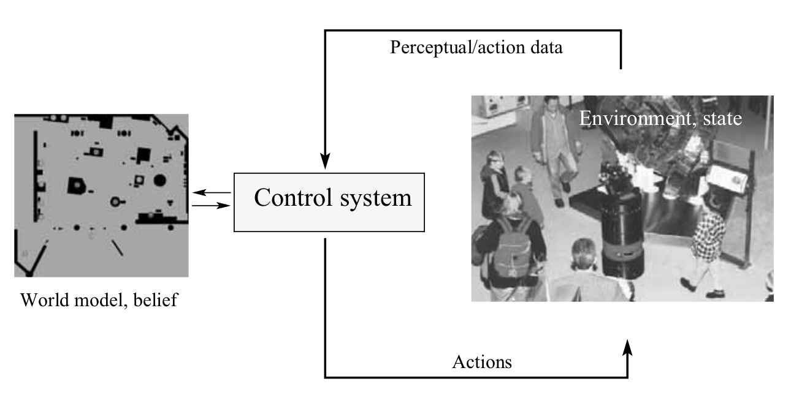
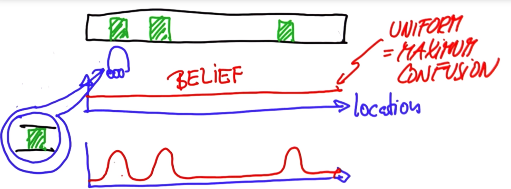
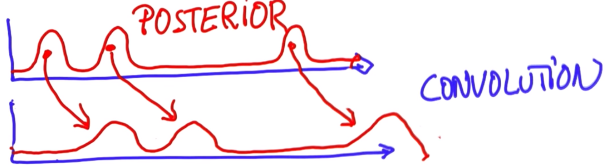
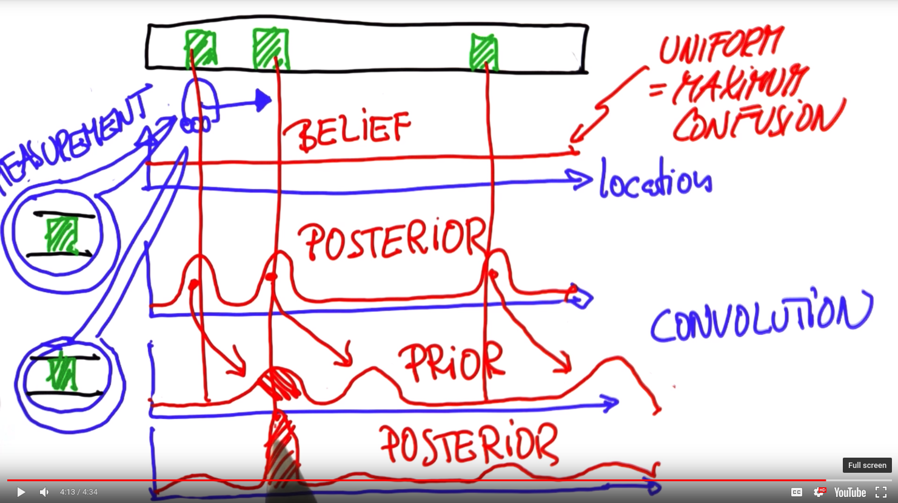
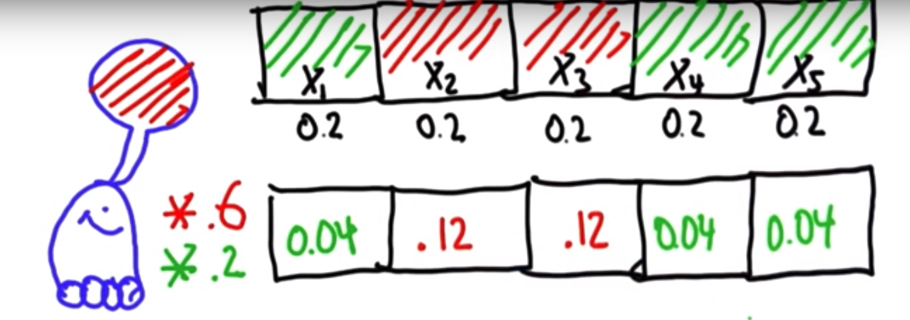

# AI for Robotics

[Localization](#localization)
- 
[Kalman Filters](#kalman-filters)

[Particle Filters](#particle-filters)

[Search](#search)

[PID Control](#pid-control)

[Simultaneous Localization and Mapping](#slam)

[References](#references)

## Introduction
### Uncertainity in Robotics
Robots have to deal with uncertainity in the world. Unless they are able to handle this uncertainity, robot applications will remain limited in scope. 

There are many factors that contribute to uncertainity. 
1. First, is the **robot environment**. Different environments have different degrees of uncertainity. Assembly lines are most structured, whereas highways and roads are much more uncertain. Robots working around people have to deal with most uncertainity. 
2. Second, is the **sensor**. Sensors are not capable of infinte accuracy, neither they can measure everything. They are often limited by their range and resolution. They are also subject to noise which perturb sensor measurements in unpredictible ways. Finally, sensors can break, and detecting faulty sensor can be extremely difficult
3. Third is **actuation**. Robot motors are imperfect, this could be due to control noise, wear-and-tear and mechanical failure. 
4. Fourth is **internal models**. The robot operates under certain assumption about the real world, embodied in internal models used by the software. These models can be faulty. Model errors are a source of uncertainity that has often been ignored in robotics
5. Fifth, is **algorithmic approximation**. Robots are real-time systems, this limits the amount of computation that can be carried out. Computational techniques employed to improve real-time performance often introduce approximation errors. 

### Probabilistic Robotics
It is a relatively new field in robotics, that pays tribute to the uncertainity in robot perception and action. The key idea in probabilistic robotics is to represent the uncertainity explicitly using calculus of probability. What this means? Instead of a single value, probabilitic algorithms represent information as probability distribution over a whole set of possible values. 

### Probabilisitc Robotics vs Traditional Robotics
Some advantages of probabilisitic robotics over traditional robotics (model based)
1. Prob. Robotics scale well for real-world environment because they explicitly model uncertainity
2. Prob. Robotics do not require accurate sensors as they can handle sensor noise
3. Prob. Robotics have weaker requirements on accuracy robot's models

Two most frequently cited limitations of probabilistic robotics
1. computational complexity
2. need to approximate: computing exact posterior for continuous space is computationally intractable. Sometimes,
one is fortunate in that the uncertainty can be approximated tightly with a compact parametric model (e.g., Gaussians). In other cases, such approximations are too crude to be of use, and more complicated representations must be employed.

## Recursive Estimation
At the core of probabilistic robotics is the idea of estimating state from sensor data. In simpler terms, **state estimation** addresses the problem of estimating quantities from sensor data that are not directly observable, but that can be inferred. Probabilistic state estimation algorithms compute belief distributions over possible world states.

We will learn the basic vocabulary for state estimation and mathematical tools for doing state estimation from sensor data.
Briefly, we learn probabilistic concepts employed in state estimation, then we cover formal model of robot-environment interaction and associated key terminology. Thirdly, we use Bayes' filter. Finally, we consider representational and computational issues that arise when implementing Bayes filters.

### Basics Concepts of Probability
In probabilisitc robotics, location of robot, sensor measurements, controls are treated as *random variables*. Probabilistic inference is the process of calculating the distributions that govern the random variables that are themselves derived from other random variables and observed data.

//TODO add equations, reference books, material


### Robot Environment Interaction
Now we will understand the modeling of robot's interaction with its environment. The image below summarizes the interaction through an information flow diagram. 



Since the robot's sensors are not perfect, it can't rely on them to sense where it is at the current moment. It needs to maintain a belief distribution map of the environment internally. It cann perform some actions which may/may not affect the environment itself. It also senses the actions it has performed as well as the environment state through sensors, this information is fed back to update the belief distribution map.

Let's start a formal description of the model. We begin by defining the terms in the model precisely

#### State
Environment are characterized by state. A state is a collection of variables that capture aspects of robot and its environment that can impact its future. We denote the state variables as *x*, this is general is a vector variable. To denote state at a certain time t, we use x<sub>t</sub>. State variables can be *dynamic* or *static*. The collection of dynamic state variables is called *dynamic-state*, and collection of static state variables is called *static-state*. 

To get you familiar with state variables, here are some typical state variables
1. **robot pose**: comprises of robot's location and orientation relative to global coordinate frame. Rigid mobile robots in 3D have 6 such variables - x,y,z,pitch,yaw,roll. Rigid mobile robots in 2D have only 3 such variables - x,y,yaw
2. **kinematic state**: these variables capture the configuration variables determining robot's actutators. Actuators are build from rigid parts connected by different types of joints such as revolute, prismatic etc. So joint angles, displacement etc constitute the state variables
3. **robot velocities**: these include the robot's velocity and velocity of its joints. A rigid body moving through 3D space is characterized by 6 velocities one for each pose variable. 
4. **location and features of surrounding objects**: An object may be a tree, chair, painting, toy. Features of such object can be their color, texture, shape etc. Depending on the state granularity environment state variables may go from a dozen to a billion state variables. 
5. **location and velocities of moving objects**: Other moving entities in the enviornment such as a car, person also have their own kinematic and dynamic state
6. **Miscellaneous**: these include failure state of the robot's sensors and actuators, battery charge and so on


**Complete State**</br>
A state x<sub>t</sub> is said to be complete it is the best predictor of future. Our definition of completeness does not require future to be deterministic, but only that no variables prior to x<sub>t</sub> may influence the future states unless this dependence is mediated through x<sub>t</sub>. 

Complete states exist only in theory, in reality one must select a subset of potential variables as state variables because of possibly unfathomably large variable set. Such a set is called the **incomplete state**. 


**State spaces** that contain both continuous and discrete state variables are called hybrid state spaces. 

#### Environmental Interaction
There are two fundamental types of interactions that robot has with its environment. These two fundamental types are actuation and sensing. 

**Data**: record of all measurements and control actions made by the robot since the beginning. In practice, all of it may not be stored. There are two type of data corresponding to the two types of interactions - actuation and sensing

**Environmental Measurement Data**: provides information about the momentary state of the environment. We assume that a particular measurement happended at a particular instant. This is strictly true for camera images but not for laser scanner which perform sequential measurements. We denote measurement data by *z* and at time t as *z<sub>t</sub>*. The notation 


z<sub>t<sub>1</sub>:t<sub>2</sub></sub> = z<sub>t<sub>1</sub>+1</sub>, z<sub>t<sub>1</sub>+2</sub>,...z<sub>t<sub>2</sub></sub>

denotes measurement taken from [t<sub>1</sub>, t<sub>2</sub>\]


**Control Data**: provide information about the change of state in the environment. In mobile robotics, this would mean velocity of the robot. Alternate source of control data are odometers. They measure revolution of robot's wheels. Even though odometers are control data, they measure the effect of a control action. 

Control data are denoted by variable *u*, and u<sub>t</sub> denotes the change of state in the time interval (t-1,t]. 

Control data is generated even when robot does not perform any action. Thus "doing nothing" constitutes a legal action. 

#### Probabilisitic Generative Laws
The evolution of state and measurements is governed by probabilistic laws. The state x<sub>t</sub> is generated stochastically from state x<sub>t-1</sub>. 

If state *x* is **complete**, then it along with current actions and measurements is sufficient to predict future states. This is succintly stated as


$$p(x_{t}|x_{0:t-1}, z_{1:t-1}, u_{1:t}) = p(x_{t}|x_{t-1},u_{t})$$

Conditional independence is the reason many of the algorithms used in robotics are computationally tractable

The probability, $p(x_{t}|x_{t-1}, u_{t})$ is known as **state transition probability**. It specifies how environmental state evolves over time as a function of robot controls, $u_{t}$. The probability
$p(z_{t}|x_{t})$ is called the **measurement probability**. The state transition probability and the measurement probability define the dynamical stochastic system of the robot and its environment. 
This system can be depicted pictorially using what is called a **hidden markov model (HMM)** or **dynamic Bayes network (DBN)**. 


#### Belief Distributions
A belief reflect robots internal knowledge about the state of the environment. We distinguish true state from its internal belief about the state. True state cannot be know by the robot. For example a robot cannot know its pose exactlly in the world frame, it infers it from data. 

In probability, we represent beliefs through conditional distributions. A belief distribution assigns a probability to each possible hypothesis with regards to the true state. They are posterior probabilities over state variables conditioned on available data. 

We denote belief over state variable *x<sub>t</sub>*, by *bel(x<sub>t</sub>)*. 

$$bel(x_{t}) = p(x_{t}|z_{1:t}, u_{1:t})$$

We silently assume that belief is taken after the measurement *z<sub>t</sub>*, but it is not necessary, it may be taken before making the measurement or action at time t. 

$$\overline{bel(x_{t})} = p(x_{t}|z_{1:t-1}, u_{1:t-1})$$

In this case belief is known as **prediction**. Calculating *bel(x<sub>t</sub>)* from prediction, is called **correction** or **measurement update**

### Bayes Filters


## Localization

### The Localization Problem
How can we know where we are with accuracy of +/- 10cm. This is much better than GPS. 

### Localization Application
Used in Google's self driving car. Takes images of the road surface, and then uses techniques to localize itself with an accuracy of a few centimeters. 

### Intuition About Localization Math
We model a robot's estimation of its position in space with a probability distribution function (pdf). Initially, the robot has no clue of where it is, so it could be anywhere. This is modeled as uniformly distributed. 

To localize, the world has to have some distinctive features or landmarks. When the robot's sensors detect landmarks, the robot can modify its belief (encoded in the localization pdf). For example, in the image below, landmarks are 3 identical doors, when robot detects a door, belieft is modified, and it now assigns equal porbability of being at one of three doors, and very low probability of being at other locations.



The new belief is referred to as the posterior belief because it is after the measurement. Now sa the robot moves, the belief moves with it. Let's understand this part... The belief is a representation of robot's position in space, if the robot were to move to right by 10m, it would now say that it is is one of the three positions 10m to the right of positions identified previously. This is depicted in the modified belief. 

Notice that, the belief peak are spread out, this is due to error in sensing movement. This is referred to as the convoluton, where the movement pdf convolves with belief pdf. Now, with a second measurement from sensors, we are able to generate a new belief which depends on the prior (convolved pdf) and current measurement. It assigns most weight to the where the second door is. 


We achive this by multiplying the prior to the belief generate by current measurements (similar to our first belief). 

### Representing probabability Distribution
We can represent probabilities as a vector. In python, this would be a list
```
p = []                                 # empty list
p = [0.2, 0.2, 0.2, 0.2, 0.2]          # list with 5 elements, represents uniform distribution over 5 grid cells

p = []
n = 5
for x in range(n):                     # generalized uniform distribution with arbitrary size (n)
    p.append(1/n)
```


### Probability After Sense

Note that even after sensing red, the probability associated with green block is non-zero. This is because the sensor measurements can be inaccurate, so it is accounted for by non-zero probability of green block. We also need to normalize the posterior belief. 

### Defining the Sense Function
The sense function takes in the current belief and sensor measurement and other globals (map of world), and generates the unnormalized posterior belief.Here is an example implmentation
```
#Modify your code so that it normalizes the output for 
#the function sense. This means that the entries in q 
#should sum to one.


p=[0.2, 0.2, 0.2, 0.2, 0.2]                       # current belief
world=['green', 'red', 'red', 'green', 'green']   # map of world
Z = 'red'                                         # current measurement
pHit = 0.6                                        
pMiss = 0.2

def sense(p, Z):
    q=[]
    for i in range(len(p)):
        hit = (Z == world[i])
        q.append(p[i] * (hit * pHit + (1-hit) * pMiss))
    return q
print sense(p,Z)
```
The final (normalized) version would look like so
```
def sense(p, Z):
    q=[]
    for i in range(len(p)):
        hit = (Z == world[i])
        q.append(p[i] * (hit * pHit + (1-hit) * pMiss))
    s = sum(q)
    for x in range(len(q)):
        q = q[x]/s
    return q
```

### Belief Distribution under precise motion
If we know the belief distribution over a linear grid, we can easily predict the belief distribution under precise motion (i.e. the robot know exactl how much it moved). A simplifying assumption here is cyclic world. 

So, how do we write code for handling perfect movement. 
```
def move(p, U):
    #
    # create a separate list q, of length p
    q = [x for x in p]

    shift = U%len(p)               # calculate shift based on cyclic grid
    for i in range(len(p)):
        q[(i+shift)%len(p)] = p[i] # assign p[i] to its shifted position in q
    return q
```
We define a function move, that takes in a belief distribution, *p* and 

### Belief Distribution under inaccurate motion
We begin with a simple case, our prior localizes our robot precisely in a single grid. Our motion however is not extact, although the intent is to move 2 grid cells to the right, actuator noise prevents this. What we have is 80% probably of moving 2 grid cells, 10% 1 grid cell and 10% 3 grid cells. This is depicted in the figure below


The above case is simplistic, but if the prior is a distribution, then how do we combine the contributions of probabilitiy of arriving in a grid cell from potentially different locations? TODO//cover this 
Now let's write a function to accomodate move probability distribution to output the posterior belief
```
def move(p, U):
    q = []
    for i in range(len(p)):
        s = 0
        s += p[(i-U)%len(p)]*pExact
        s += p[(i-U-1)%len(p)]*pOvershoot
        s += p[(i-U+1)%len(p)]*pUndershoot
        q.append(s)     # for each location is posterior belief, sum contributions from all locations in prior belief,
    return q
```
In the limiting case of inifinite number of movements, the final belief distribution approximates the uniform distribution closely. The mathematical derivation of it is based on [balance equation](https://en.wikipedia.org/wiki/Balance_equation). Intuitively, each motion leads to loss of information, the information keeps decreasing until its reaches the least informative distribution - uniform distribution. 


### Sensing and Moving
This is an important point. These two words - sensing and moving lie are fundamental to localization. We start with an initial belief and then localization iterates through moving and sensing indefinitely. Moving causes loss of information, and sensing leads to gain of information. 


There is a measure of information called entropy, described mathematically as 
$$- \sum p(X_{i}).log(p(X_{i}))$$

### Summary of Localization

Succintly put, localization consists of 3 things
1. Belief: A distribution indicating where the robot is 
2. Sense: Product of Belief and Measurements, followed by normalization 
3. Move: Convolve (Read contributions and add them)


### Bayes Rule
In our context, it mathematically depicts the process of measurement. Bayes rule is stated as
$$p(X_{i}|Z) = \frac{p(Z|X_{i}).p(X_{i})}{p(Z)}$$

Here, p(X<sub>i</sub>) is the **prior**, p(Z|X<sub>i</sub>) is the **measurement** and p(X<sub>i</sub>|Z) is the **posterior**


### Theoram of Total Probability
In our context, motion calculation are mathematically described using the [total probability theoram](https://en.wikipedia.org/wiki/Law_of_total_probability)

$$p(X^{t}_{i}) = \sum p(X^{t-1}_{j}).p(X_{i}|X_{j})$$


p(X<sup>t-1</sup><sub>j</sub>): all the different j's we could have come from to i, all the prior probabilities
p(X<sub>i</sub>|X<sub>j</sub>): transition probabilities that I go from j to i given the motion command

Operation of weighted sum over prior probabilities is often called **convolution**


## Kalman Filters

## Particle Filters

## Search

## PID Control

## SLAM


## References
- [Udacity AI for Robotics](https://classroom.udacity.com/courses/cs373)
- Seminal Papers in Probabilistic Robotics
  - [Kalman Filter Techniques for High-Dimensional Perception, Smith and Cheesman, 1986](https://www.frc.ri.cmu.edu/~hpm/project.archive/reference.file/Smith&Cheeseman.pdf)
  - Invention of occupancy grid maps
    - [Elfes, 1987](https://www.cs.cmu.edu/~motionplanning/papers/sbp_papers/integrated4/elfes_occup_grids.pdf)
    - [Moravec, 1988](http://www.aaai.org/ojs/index.php/aimagazine/article/viewFile/676/594)
  - [Partially Observable Planning Techniques, Kaelbling, 1998](https://www.seas.upenn.edu/~mkearns/papers/barbados/klc-pomdp.pdf)
  - [Particle Filters, Dellaert, 1999](https://www.ri.cmu.edu/pub_files/pub1/dellaert_frank_1999_2/dellaert_frank_1999_2.pdf)
  - Bayesian Information Processing
    - [Thrun, 2000b](http://www.cs.cmu.edu/~thrun/movies/papers/thrun.map3d.pdf)
    - [Lebeltel, 2004](http://citeseerx.ist.psu.edu/viewdoc/download?doi=10.1.1.104.7379&rep=rep1&type=pdf)
    - [Park, 2005](http://reports-archive.adm.cs.cmu.edu/anon/anon/usr/ftp/usr0/ftp/2004/CMU-CS-04-173.pdf)
