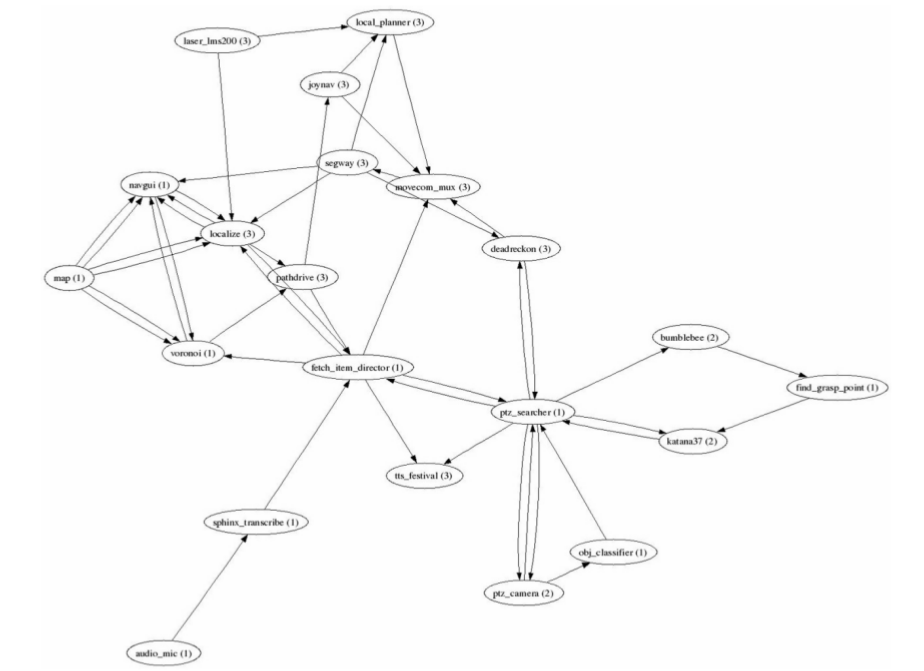

[ROS Overview](#ros-overview)

[ROS Course](#ros-course)

# ROS Overview

## What is ROS?
It is a meta-OS for a robot. Like an OS, it provides certain services, abstracts the hardware and facilitates message passing between processes. In addition, it also provides package management. It also provides tools for downloading, building, writing and running code across multiple computers. 

ROS runtime can be described as a peer-to-peer network of running processes that communicate using the ROS infrastructure. ROS implements synchronous RPC style communication over *services* and asynchronous communication style using *topics*. 

## What were the goals behind creation of ROS?
Primary goal is to support code reuse. As mentioned above, ROS runtime is a peer-to-peer network of running processes. Each processes is a running executable. These executables can be individually designed and maintained. ROS enables these executables grouped into *Packages* and *Stacks* and distributed for reuse. 

In addition to this main goal, there are other desirables that ROS tries to meet

1. Thin: ROS is designed to be as thin as possible
2. ROS-agnostic libraries: Libraries should be ROS agnostic with clean functional interfaces
3. Lanugage Independence: ROS is not heavily language dependent. There are implementation of ROS in python and C++

## ROS Concepts
ROS has three levels of concepts - **filesystem** level, **computation graph** level and **community** level. ROS has a naming scheme, wherein it uses two types of names - **Package Resource Name** and **Graph Resource Name**

### File System Level
At file system level, we deal with ROS resources found on the disk

1. **Packages**: Main unit for organizing code. It is the most atomic build and release item in ROS. It may contain a ROS runtime processes' executable, ROS-dependent library, datasets, configuration files etc. 
2. **Metapackages**: Specialized packages that serve to represent a group of related packages. 
3. **Package Manifests**: Manifests are xml files, which contain metadata about a package such as its name, version, description, license information, dependencies etc
4. **Repositories**: A collection of packages that share a common version control system. Packages that share a VCS, share the version number, and can be released together. Repos can also contain just a single package
5. **Message types**: Message descriptions. These are stored in package/msg/MessageType.msg files. They define the data structure for **messages** send in ROS
6. **Service types**: Service Description. These are stored in package/srv/ServiceType.srv. They define the **request** and **response** data structure for services in ROS. 

### Computation Graph
ROS runtime is a peer-to-peer network of ROS processes. The basic concepts in this graph are as follows:
Below is a picture of a computation graph, the ovals are nodes in the graph, they represent ROS nodes. The edges represent the ROS message streams. 

1. **Nodes**: Nodes are processes that are performing computation. A node is a piece of code, that is written using ROS client libraries such as **roscpp** or **rospy**. 
2. **Master**: ROS master provides name registration and lookup to all other nodes in the computational graph. 
3. **Parameter Server**: stores data dictionary, accessible by key in a central location. It is part of the Master. 
4. **Messages**: Nodes communicate with each other by passing messages
5. **Topics**: Messages are routed via a transport system with publish/subscribe semantics. A node sends out a message by publishing it to a topic. The **topic** is a **name** that is used to identify the content of the message. One can think of topic as a strongly typed message bus. 
6. **Services**: Request/Reply is achieved via services which are defined by a pair of message structures. A serving node provides a **service** under a **name**. The client node sends a request to this service and awaits a reply. ROS client API presents this as an RPC cal. 
7. **Bags**: a format for saving and playing back ROS message data. They are an important mechanism for storing data. 

#### How does the computation graph work?
//TODO

### Community
These concepts relate to ROS resources that help the community exchange software

1. **Distributions**: collections of versioned stacks that you can install on your system. Distributions play a similar role to Linux distributions, they make it easier to install a collection of software, and they also maintain consistent versions across a set of software.
2. **Repositories**: ROS relies on a federated network of code repositories
3. **ROS Wiki**: Main forum for documenting information about ROS. Anyone can sign up for an account and contribute their own documentation, write tutorials etc.
4. **Mailing List**: mailing-list to get new updates, and ask questions
5. **ROS Answers**: Q&A site for ROS related questions
6. **Blog**: provides regular updates

### Names

#### Graph Resource Names
These names provide a heirarachichal naming structure that is used for all resources in ROS Computation Graph. So this is a systematic method of assigning names to **nodes**, **parameters**, **topics** and **services**. 

Graph Resource Names provide encapsulation, to expand on it, each resource is defined within a namespace. It can address other resources within its namespace as well as those in namespaces above it. Resources are allowed only to create other resources within their own namespace. If connections need to be made b/w two distinct namespaces, then that needs to facilitated by some code, above both namespaces. 

**Name Resolution** 
Names are resolved relatively i.e. if I am a resource, in need of accessing another resources, I will simply look for that name. Implicitly, I will be looking in the namespace I belong to. If not found here, I will be looking in the namespace up one level. 

To understand name resolution better, it is important to understand that there are 4 types of graph resource names - **global**, **relative**, **private** and **base**. 
    
    
 |Name Type| Description|
 |---------|------------|
 |relative |Resolution is done relative to node's namespace, so for /wg/node1, the namespace is /wg, so node2 will resolve to /wg/node2|
 |base     |Names with no namespace qualifiers are base names|
 |global   |Names that start with a / are global. They are considered fully resolved, and no name resolution is performed for them|
 |private  |Names that start with a tilde, ~, are private. When resolving them, the parent node's name is considered a namespace|
 
 
 Here are some examples
 
|Node|Relative (default)|Global|Private|
|----|------------------|------|-------|
|/node1|bar -> /bar|/bar -> /bar|~bar -> /node1/bar|
|/wg/node2|bar -> /wg/bar|/bar -> /bar|~bar -> /wg/node2/bar|
|/wg/node3|foo/bar -> /wg/foo/bar|/foo/bar -> /foo/bar|~foo/bar -> /wg/node3/foo/bar|

**Remapping** 
Any name within a ROS node can be remapped. More on this later. 

#### Package Resource Names
These names provide a way of referring to ROS filesystem resources. Typically any resource name is prefixed with a package name. ROS is able to resolve it because it is able to locate Packages on disk and make certain assumptions about the structure of the Package. Let's understand it better through some examples

|Name|Resolution|Description|
|----|----------|-----------|
|std_msgs/String|path_to_std_msgs/std_msgs/msg/String.msg|Messages are always stored in msg subdirectory and have a .msg extension|
|foo/bar|/path_to_foo/bar|searches for an executable file named bar in package foo|

## ROS High-Level Concepts
ROS is pretty general, and is designed in such a way so as to be agnostic about the robot architecture. The ROS makers claim that to be build larger system, there is need for additional generalized higher level concepts. We'll go over these

### Coordinate Frames/Transforms
The `tf` is a ROS package. It provides a distributed framework for calculating poses (position + orientation) of multiple coordinate frames over time. 

### Actions/Tasks
The `actionlib` package defines a topic based interface for preemptible tasks in ROS. The actionlib enables a fire-and-forget interface. Unlike service which is a blocking call, actionlib tasks are non-blocking. Further they are allowed to be preempted if taking too long for example. As far as the use cases go, services are used for quick updates, the request-response cycle is completed very quickly. If the response may take much longer, actionlib tasks are the appropriate choice. 

Here is a [discussion](http://wiki.ros.org/ROS/Patterns/Communication#Communication_via_Topics_vs_Services_vs_X)

### Message Ontology
The *common_msgs* stack provides a base message ontology for robotic systems. It defines several classes of messages

1. *actionlib_msgs*
2. *diagnostic_msgs*
3. *geometry_msgs*
4. *nav_msgs*
5. *sensor_msgs*

### Plugins
plugin stack provides an API for dynamically loading C++ libraries. 
//TODO: well revisit this later

### Filters
`filters` packages is a C++ library for implementing processing pipeline using a sequence of filters. The package contains a base class `Filter` upon which specific implementations of filters are built. When there is a need to use more than one filter, a filter chain `filter::FilterChain` object is created.
//TODO: We'll come back to this later

### Robot Model
This refers to the `urdf` packages. This package contains a C++ parser for reading xml files detailing the robot model. This package contains a number of XML specifications for robot models, sensors, scenes, etc. Each XML specification has a corresponding parser in C++. 

## ROS Client Libraries
ROS client library is a collect of code, that maps the ROS concepts to C++ based ROS programming API. Here is a summary of `roscpp` API

|API Name| Description|
|--------|------------|
|ros::init()|A version of ros::init() must be called before using any of the rest of the ROS system|
|ros::NodeHandle|Public interface to topics, services, parameters, etc.|
|ros::master|Contains functions for querying information from the master|
|ros::this_node|Contains functions for querying information about this process' node|
|ros::service|Contains functions for querying information about services|
|ros::param|Contains functions for querying the parameter service without the need for a ros::NodeHandle|
|ros::names|Contains functions for manipulating ROS graph resource names|

# ROS Course

