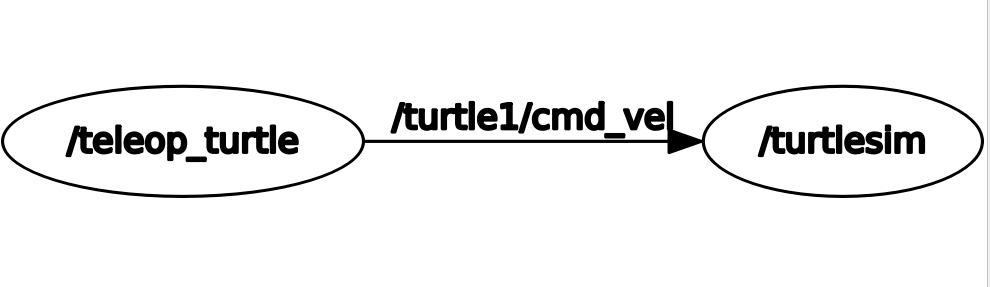
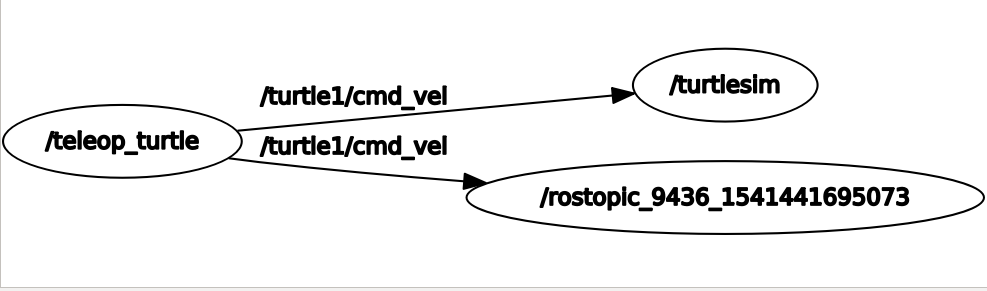
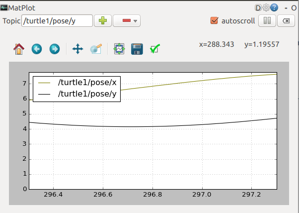

# ROS Tutorials
- [Installation](#installation)
  - [Which Distribution to Use?](#which-distribution-to-use)
  - [ROS Kinetic Kame Installation Instructions for Ubuntu 16.04 LTS](#ros-kinetic-kame-installation-instructions-for-ubuntu-16-04-lts)
  - [Maintaining ROS Environment](#maintaining-ros-environment)
  - [Creating a ROS Workspace](#creating-a-ros-workspace)
- [Navigating the ROS Filesystem](#navigating-the-ros-filesystem)
  - [Finding package location](#finding-package-location)
  - [Navigating to package location](#navigating-to-package-location)
  - [Listing directory contents](#listing-directory-contents)
- [Creating a ROS package](#creating-a-ros-package)
  - [Creating a package using catkin](#creating-a-package-using-catkin)
  - [Building a catkin workspace](#building-a-catkin-workspace)
  - [Dependency Management](#dependency-management)
  - [Customizing the package](#customizing-the-package)
  - [File Package.xml](#file-package-xml)
- [Building a ROS package](#building-a-ros-package)
  - [Using catkin_make](#using-catkin_make)
  - [Building the Package](#building-the-package)
- [Understanding Nodes](#understanding-nodes)
  - [What is a node?](#what-is-a-node)
  - [Before running a node](#before-running-a-node)
  - [How to run a node?](#how-to-run-a-node)
- [Understanding ROS Topics](#understanding-ros-topics)
  - [Visualizing the ROS graph](#visualizing-the-ros-graph)
  - [Rostopic](#rostopic)
    - [Printing Topic data to terminal](#printing-topic-data-to-terminal)
    - [Listing all topics](#listing-all-topics)
  - [ROS Messages](#ros-messages)
  - [Publishing Data](#publishing-data)
  - [Viewing publish rate](#viewing-publish-rate)
  - [Combining rostopic type and rosmsg show](#combining-rostopic-type-and-rosmsg-show)
  - [Using rqt_plot](#using-rqt_plot)
- [Understanding ROS Services and Parameters](#understanding-ros-services-and-parameters)
  - [Rosservice](#rosservice)
    - [Service Type](#service-type)
    - [Calling a service using Commandline](#calling-a-service-using-commandline)
  - [Using Rosparam](#using-rosparam)
    - [Setting and Getting Parameters](#setting-and-getting-parameters)
  - [Dumping and Loading parameters](#dumping-and-loading-parameters)
- [Using Rqt_console and roslaunch](#using-rqt_console-and-roslaunch)
  - [Using rqt_console and rqt_logger_level](#using-rqt_console-and-rqt_logger_level)
  - [Logger Level](#logger-level)
  - [Using roslaunch](#using-roslaunch)
  - [Creating a launch file](#creating-a-launch-file)
  - [Let's roslaunch](#lets-roslaunch)
- [Rosed](#rosed)
- [Creating a ROS message and service](#creating-a-ros-message-and-service)
  - [Introduction to msg and srv](#introduction-to-msg-and-srv)
  - [Using msg](#using-msg)
  - [Using srv](#using-srv)
  - [Common Step for msg and srv](#common-step-for-msg-and-srv)
- [Writing a Simple Publisher/Subscriber in C++](writing-a-simple-publisher-subscriber-in-c++)
  - [Writing a Publisher](#writing-a-publisher)
  - [Writing a Subcriber](#writing-a-subscriber)
  - [Building Nodes](#building-nodes)
- [Writing a Simple Client/Service node](#writing-a-simple-client-service-node)
  - [Writing the Service node](#writing-the-service-node)
  - [Writing the Client node](#writing-the-client-node)
  - [Building your node](#building-your-node)
- [Recording and Playing Back Data](#recording-and-playing-back-data)
  - [Recording the data in a bag file](#recording-the-data-in-a-bag-file)
  - [Recording a subset of data](#recording-a-subset-of-data)

[Catkin](#catkin)
- [Overview](#overview)
- [Why does ROS have a custom build system?](#why-does-ros-have-a-custom-build-system)
- [Catkin Workspace](#catkin-workspace)
  - [What is a catkin workspace?](#what-is-a-catkin-workspace)
  - [package.xml structure](#package-xml-structure)

[References](#references)

## Roadmap
- General ROS
  - [RViz](http://wiki.ros.org/rviz)
  - [TF](http://wiki.ros.org/tf2)
  - [Simulation](http://emanual.robotis.com/docs/en/platform/turtlebot3/simulation/#turtlebot3-simulation-using-gazebo)
- [Navigation](http://wiki.ros.org/navigation)
- [ROS on Different Machines](http://wiki.ros.org/ROS/Tutorials/MultipleMachines)
- [PCL](http://wiki.ros.org/pcl/Tutorials)
- [rosserial](http://wiki.ros.org/rosserial?distro=melodic)


## Installation
There is more than one distribution of ROS supported at a time. Some are older releases with long term support, other are newer releases with shorter support lifetimes.

The following versions are recommended
1. [ROS Kinetic Kame](http://www.ros.org/reps/rep-0003.html#kinetic-kame-may-2016-may-2021) - supported until April, 2021
2. [ROS Melodic Morenia](http://www.ros.org/reps/rep-0003.html#melodic-morenia-may-2018-may-2023) - supported until May, 2023


### Which Distribution to Use?
Based on the [recommendation](http://wiki.ros.org/Distributions).

|New Capability|Major Update Frequency|Recommended Distro|
|--------------|----------------------|------------------|
|Preferred but not required|Not preferred|Latest LTS|
|Much Preferred|Acceptable|Latest|
|Much Preferred|Not Preferred|Switch to Latest LTS every 2 years|
|Specific Platform Required (other than Ubuntu 16.04| See REP-3|
|Newer Gazebo needed||Kinetic for Gazebo v7|
|Use opencv3||Indigo or later|

 
### ROS Kinetic Kame Installation Instructions for Ubuntu 16.04 LTS

We will not build the ROS using source code, rather we'll use the recommended method of installing ROS using debian packages

1. Set up source list
2. Obtain key from ROS key server using `apt-key`
```
> sudo apt-key adv --keyserver hkp://ha.pool.sks-keyservers.net:80 --recv-key 421C365BD9FF1F717815A3895523BAEEB01FA116
[sudo] password for rk: 
Executing: /tmp/tmp.9JOTvWUECn/gpg.1.sh --keyserver
hkp://ha.pool.sks-keyservers.net:80
--recv-key
421C365BD9FF1F717815A3895523BAEEB01FA116
gpg: requesting key B01FA116 from hkp server ha.pool.sks-keyservers.net
gpg: key B01FA116: public key "ROS Builder <rosbuild@ros.org>" imported
gpg: Total number processed: 1
gpg:               imported: 1

```
3. update the debian package index 
```
> sudo apt-get update
```
4. We will use the full-desktop installation of kinetic-kame
```
> sudo apt-get install ros-kinetic-desktop-full
```
This installation will take about 450MB of space. 

5. Configure rosdep: rosdep is a command-line tool for installing system dependencies. For *end-users*, rosdep helps you install system dependencies for software that you are building from source. [Here](http://docs.ros.org/independent/api/rosdep/html/commands.html) are usage instructions

```
> rosdep init
Wrote /etc/ros/rosdep/sources.list.d/20-default.list
Recommended: please run

	rosdep update
> rosdep update
reading in sources list data from /etc/ros/rosdep/sources.list.d
Hit https://raw.githubusercontent.com/ros/rosdistro/master/rosdep/osx-homebrew.yaml
Hit https://raw.githubusercontent.com/ros/rosdistro/master/rosdep/base.yaml
Hit https://raw.githubusercontent.com/ros/rosdistro/master/rosdep/python.yaml
Hit https://raw.githubusercontent.com/ros/rosdistro/master/rosdep/ruby.yaml
Hit https://raw.githubusercontent.com/ros/rosdistro/master/releases/fuerte.yaml
Query rosdistro index https://raw.githubusercontent.com/ros/rosdistro/master/index.yaml
Add distro "groovy"
Add distro "hydro"
Add distro "indigo"
Add distro "jade"
Add distro "kinetic"
Add distro "lunar"
Add distro "melodic"
updated cache in /home/rk/.ros/rosdep/sources.cache
```

6. Configure bashrc to load ROS environment variables automatically


### Maintaining ROS Environment
ROS relies on the notion of combining spaces using the shell environment. This makes developing against different versions of ROS or against different sets of packages easier. 

To check if ROS environment is set properly, print your environment variables and look for ROS environment variables 
```
> printenv | grep ROS
```
If they are not, then some setup.sh files may need to be sourced, or hardcoded into into .bashrc. 
Environment setup files are generated 3 ways
1. ROS packages installed with package managers provide setup.sh files
2. rosbuild workspaces provide setup.sh files using tools like rosws
3. setup.sh files are created as a byproduct of building or installing catkin packages


### Creating a ROS Workspace
This pertain to catkin workspaces. We'll come back to this later. For now we'll simply create a **catkin workspace** and move on

Create a directory anywhere you want, preferrably somewhere in user's home directory on linux, name it anyway you want, we choose an apt name `catkin_ws`
```
> mkdir catkin_ws
> cd catkin_ws; mkdir src
> catkin_make
```
catkin_make is one of many catkin commands. It generate a `CMakeList.txt` in the src directory. In addition, it will create a `devel` development directory, and an `build` installation directory. 
The devel directory contains setup.sh files, which contains redefinition of some ROS environment variables. Sourcing these files will overlay your workspace on top of the ROS environment. 
We want to work in this workspace, so we'll source the setup files
```
> source devel/setup.sh
```
To make sure your workspace is properly overlayed by the setup script, make sure ROS_PACKAGE_PATH environment variable includes the directory you're in.

```
> echo $ROS_PACKAGE_PATH
/home/rk/repos/Robotics/scratch/catkin_ws/src:/opt/ros/kinetic/share
```
## Navigating the ROS Filesystem

### Finding package location
In ROS, code is spread over many packages. We'll cover a few role command-line tools used to navigate the ROS filesystem. To do these exercise, we'll first install a tutorial package from the online ROS debian package repository using apt-get.
```
> sudo apt-get install ros-kinetic-ros-tutorials
```
We'll use command-line tools `rospack` to find packages. 
```
> rospack find roscpp_tutorials
/opt/ros/kinetic/share/roscpp_tutorials
```
The above show the location where roscpp_tutorials are installed by apt-get. 

### Navigating to package location
We use roscd for it. We only need to provide the package name to the command
```
> pwd
/home/rk/repos/Robotics/scratch/catkin_ws
> roscd roscpp_tutorials
> pwd
/opt/ros/kinetic/share/roscpp_tutorials
```
roscd can also move to a subdirectory of a package like so
```
> roscd roscpp_tutorials/srv
> pwd
/opt/ros/kinetic/share/roscpp_tutorials/srv
```
`roscd log` will take you to the directory where ROS log files are stored. 

### Listing directory contents
`rosls` allows you to `ls` directory contents simply by refereing to the package name. Here is an example
```
> rosls roscpp_tutorials
cmake  launch  package.xml  srv
```

## Creating a ROS package
### Creating a package using catkin
Since we will use the catkin build system to manage this package, its of type *catking package*. By creating, we mean we'll add some content to it. There is some boilerplate stuff that needs to be in the package folder, for it to be called a package. 
1. The package must contain a catkin compliant **package.xml**
2. The package must contain a **CMakeLists.txt** which uses catkin
3. Each package must have its own directory, this means no nested packages, or multiple packages sharing the same directory. 


The recommended method of working with catkin packages is using a catkin workspace, but you can also build catkin packages standalone. We will demonstrate catkin package creation using `catkin_create_pkg` script. 

catkin packages will be created in **src** directory of catkin workspace
```
> cd catkin_ws/src
> catkin_create_pkg package_name  dep1 dep2.... depn                        # dep1... depn are an optional list of dependencies on which the package depends
> ls
beginner_tutorials  CMakeLists.txt
```
As you can see a new directory of name package_name has been added. This has additional contents. At the minimum it will contains CMakeLists.txt and package.xml file. 

### Building a catkin workspace
Navigate back to the top level folder, and invoke catkin_make
```
> cd ../catkin_ws
> pwd
catkin_ws
> catkin_make
> ls

```
After the workspace has been built, it will have a structure similar to /opt/ros/kinetic. In a sense it is expected, because ROS distribution is a collection of packages and so is a workspace. 
To add workspace to ROS environment, it needs to be sourced
```
> source devel/setup.sh
```
After you complete this, you will be able to use the ROS navigation commands with the package_name. For example to navigate to package from anywhere in the filesystem, simply type
```
> roscd beginner_tutorials
> pwd
/home/rk/repos/Robotics/scratch/catkin_ws/src/beginner_tutorials
```

### Dependency Management
rospack can be used to inspect the first order dependencies of a package like so
```
> rospack depends1 beginner_tutorials
roscpp
rospy
std_msgs
```
In many cases, a dependency will also have its own dependency, one can use rospack pack in a similar manner, just be replacing the package name with a new package's name
```
> rospack depends1 rospy
genpy
roscpp
rosgraph
rosgraph_msgs
roslib
std_msgs
```

To list all dependencies for a package (direct and indirect) recursively, do like so
```
> rospack depends beginner_tutorials
```

### Customizing the package
For this we'll need to delve deeper into the structure of a package and even the files therein. 

### File Package.xml
There is one such file per package, it should be located in `src/package_name` directory correponding to the package *package_name*. 
[see detailed description](#package-xml-structure)


## Building a ROS package
If all system dependencies are installed, a package is ready to be built
[TODO: continue here](http://wiki.ros.org/ROS/Tutorials/BuildingPackages)

### Using catkin_make
We have already seen how to build packages using catkin_make. It is a command line which combines calls to cmake and make in the standard cmake workflow. Below is the example usage
```
> catkin_make [make_targets] [-DCMAKE_VARIABLES=...]
```
Just so that we are on the same page, below is a cmake workflow
```
# In a CMake project
$ mkdir build
$ cd build
$ cmake ..
$ make
$ make install  # (optionally)
```
The above process is run for each cmake project. In contrast more than one catkin project can be built together in workspaces. Building zero or more catkin packages in a workspace follows this workflow
```
# In a catkin workspace
$ catkin_make
$ catkin_make install  # (optionally)
```
The above will build all projects in the src folder inside a catkin workspace. If you src folder is located in a different location, then the following workflow applies
```
# In a catkin workspace
$ catkin_make --source my_src
$ catkin_make install --source my_src  # (optionally)
```

### Building the Package
You should already have a catkin workspace and a new catkin package called beginner_tutorials in the src folder. Let's verify that
```
> cd catkin_ws
> pwd
/home/rk/repos/Robotics/scratch/catkin_ws                  # in the catkin workspace
> ls src
beginner_tutorials  CMakeLists.txt                         # beginner_tutorials is present
```
While in the top level folder, catkin_ws, invoke catkin_make
```
> catkin_make
```
This typically generates a lot of output from cmake and make. On my Ubuntu 16.04LTS, this was the output
```
Base path: /home/rk/repos/Robotics/scratch/catkin_ws
Source space: /home/rk/repos/Robotics/scratch/catkin_ws/src
Build space: /home/rk/repos/Robotics/scratch/catkin_ws/build
Devel space: /home/rk/repos/Robotics/scratch/catkin_ws/devel
Install space: /home/rk/repos/Robotics/scratch/catkin_ws/install
####
#### Running command: "cmake /home/rk/repos/Robotics/scratch/catkin_ws/src -DCATKIN_DEVEL_PREFIX=/home/rk/repos/Robotics/scratch/catkin_ws/devel -DCMAKE_INSTALL_PREFIX=/home/rk/repos/Robotics/scratch/catkin_ws/install -G Unix Makefiles" in "/home/rk/repos/Robotics/scratch/catkin_ws/build"
####
-- Using CATKIN_DEVEL_PREFIX: /home/rk/repos/Robotics/scratch/catkin_ws/devel
-- Using CMAKE_PREFIX_PATH: /opt/ros/kinetic
-- This workspace overlays: /opt/ros/kinetic
-- Using PYTHON_EXECUTABLE: /usr/bin/python
-- Using Debian Python package layout
-- Using empy: /usr/bin/empy
-- Using CATKIN_ENABLE_TESTING: ON
-- Call enable_testing()
-- Using CATKIN_TEST_RESULTS_DIR: /home/rk/Documents/Repos/Robotics/scratch/catkin_ws/build/test_results
-- Found gmock sources under '/usr/src/gmock': gmock will be built
-- Found gtest sources under '/usr/src/gmock': gtests will be built
-- Using Python nosetests: /usr/bin/nosetests-2.7
-- catkin 0.7.14
-- BUILD_SHARED_LIBS is on
-- ~~~~~~~~~~~~~~~~~~~~~~~~~~~~~~~~~~~~~~~~~~~~~~~~~
-- ~~  traversing 1 packages in topological order:
-- ~~  - beginner_tutorials
-- ~~~~~~~~~~~~~~~~~~~~~~~~~~~~~~~~~~~~~~~~~~~~~~~~~
-- +++ processing catkin package: 'beginner_tutorials'
-- ==> add_subdirectory(beginner_tutorials)
-- Configuring done
-- Generating done
-- Build files have been written to: /home/rk/Documents/Repos/Robotics/scratch/catkin_ws/build
```
Note that at the top, is a list of paths that catkin is using which indicates where it will look for packages, where it will store builds and where it will store installations. As a results several folder are created in the catkin workspace. 
```
> pwd
/home/rk/repos/Robotics/scratch/catkin_ws                  # in the catkin workspace
> ls
build  devel  src                                          # folder created in addition to src
```

## Understanding Nodes
From this point on, we cover ROS graph concepts and use of roscore, rosnode and rosrun

We will be using a tutorials package from ROS, lets install it using apt-get
```
> sudo apt-get install ros-kinetic-ros-tutorials            # replaced distro with kinetic in ros-<distro>-ros-tutorials
```

### What is a node?
Node is simply a an executable file within a ROS package. ROS are written in C++/Python and use the ROS client API to communicate with other nodes. This API allows nodes to publish/subscribe to a topic or use/provide a service. For C++, ROS provide the roscpp client library. 

### Before running a node
The first thing that should be run, is roscore. In the terminal, write
```
> roscore
... logging to /home/rk/.ros/log/230b56ee-e11b-11e8-a00e-60d819ce9d18/roslaunch-ThinkPad-X220-5390.log
Checking log directory for disk usage. This may take awhile.
Press Ctrl-C to interrupt
Done checking log file disk usage. Usage is <1GB.

started roslaunch server http://ThinkPad-X220:35015/
ros_comm version 1.12.14


SUMMARY
========

PARAMETERS
 * /rosdistro: kinetic
 * /rosversion: 1.12.14

NODES

auto-starting new master
process[master]: started with pid [5401]
ROS_MASTER_URI=http://ThinkPad-X220:11311/

setting /run_id to 230b56ee-e11b-11e8-a00e-60d819ce9d18
process[rosout-1]: started with pid [5414]
started core service [/rosout]
```
As you can see it generates copious output. Important, it has started roslaunch server at `http://ThinkPad-X220:35015/`. It alsoo summarizes the nodes created - master, rosout-1. It also mentions that it has started new services available at /rosout

We will now query the nodes using `rosnode`. In a new terminal
```
> rosnode list
/rosout
```
The `rosnode info` command returns information about a specific node such as subscription/publications on topics and provision of services
```
> rosnode info /rosout
--------------------------------------------------------------------------------
Node [/rosout]
Publications: 
 * /rosout_agg [rosgraph_msgs/Log]

Subscriptions: 
 * /rosout [unknown type]

Services: 
 * /rosout/get_loggers
 * /rosout/set_logger_level


contacting node http://ThinkPad-X220:41411/ ...
Pid: 5414
```

### How to run a node?
We'll use rosrun to invoke a node. `rosrun` allows you to use the package name to directly run a node within a package (without having to know its path)
```
> rosrun [package_name] [node_name]
```
We will run the turtlesim node in turtlesim package. lets open another terminal 
```
> rosnode turtlesim turtlesim_node
```
This will pop up a window showing a turtle. One can also now verify that additional node is running by listing them.
```
> rosnode list
/rosout
/turtlesim
```
So, in addition to /rosout, we have a /turtlesim node running. If you want a better name for your running executable, you can do name remapping at the time of invocation. 
```
> rosrun turtlesim turtlesim_node __name:=my_turtle
> rosnode list
/my_turtle
/rosout
```
As you can see, we have a new name for turtlesim_node. To test that this node is running, we ping it
```
> rosnode ping /my_turtle
rosnode: node is [/my_turtle]
pinging /my_turtle with a timeout of 3.0s
xmlrpc reply from http://ThinkPad-X220:41099/	time=0.579119ms
xmlrpc reply from http://ThinkPad-X220:41099/	time=1.505136ms
```

## Understanding ROS Topics
We'll cover `rostopics` and `rqt_plot`. We invoke another node `turtle_teleop_key` to record key presses
```
> rosrun turtlesim turtle_teleop_key
```
Now we can make the turtle move using the arrow keys. The turtlesim_node and the turtle_teleop_key node are communicating with each other over a ROS Topic. turtle_teleop_key is **publishing** the capturing key strokes and publishing them on a topic, which turtlesim subscribes to. It then processes these messages to move the turtle on the screen. 

### Visualizing the ROS graph
If you have already installed `rqt_graph`, simply do the following
```
> rosrun rqt_graph rqt_graph
```
It will generate an image like below, depicting the graph


It shows that turtle_teleop_key is publishing over the topic /turtle1/cmd_vel. /turtlesim is subscribing to this topic. 

### Rostopic
This command line tools provides information about ROS topics. 


#### Printing Topic data to terminal
The `echo` sub-command prints the data streaming over the topic to screen
```
>rostopic echo /turtle1/cmd_vel                     # rostopic echo [topic_name]
```
What is happening behind the scenes is that another node has been spawned, it subscribes to the topic, when it receives the topic messages, it prints them onto the screen. 




#### Listing all topics
To view list of all topics currently subscribed or published
```
> rostopic list
/rosout
/rosout_agg
/turtle1/cmd_vel
/turtle1/color_sensor
/turtle1/pose
```

### ROS Messages
Communication on topics happens by sending ROS messages between nodes. The type of the message sent over a topic can be determined by `rostopic type [topic]` command. 
```
> rostopic type /turtle1/cmd_vel
geometry_msgs/Twist
```
To get more detail on the message we use the `rosmsg` command line utility
```
> rosmsg show geometry_msgs/Twist
geometry_msgs/Vector3 linear
  float64 x
  float64 y
  float64 z
geometry_msgs/Vector3 angular
  float64 x
  float64 y
  float64 z
```

### Publishing Data
We can use command line tools to publish data messages on an existing topic. To do this, we use the `pub` subcommand of rostopic. 
```
> rostopic pub -1 /turtle1/cmd_vel  geometry_msgs/Twist -- '[2.0, 0.0, 0.0]' '[0.0, 0.0, 1.8]' # rostopic pub [topic] [msg_type] [args]
```
The command will send a message to turtlesim_node, telling it to move with a linear velocity of 2.0 and angular velocity of 1.8. This will move the turtle. 

The `-1` option causes rostopic to only publish one message and then exit. The `--` option tell the option parser that non of following arguments is an option. The arguments are provided in the [YAML syntax](http://wiki.ros.org/ROS/YAMLCommandLine)

One can also provide a steady stream of messages using `-r [pub_freq_in_HZ]` option like so
```
$ rostopic pub /turtle1/cmd_vel geometry_msgs/Twist -r 1 -- '[2.0, 0.0, 0.0]' '[0.0, 0.0, -1.8]'
```
### Viewing publish rate
We can view the rate at which data is being published using the `hz` sub-command
```
> rostopic hz /turtle1/pose   #  rostopic hz [topic]
```

### Combining rostopic type and rosmsg show
We can feed output of one command into input of second command using linux pipe (`|`) facility. This should generate the expected output detail msg structure
```
> rostopic type /turtle1/cmd_vel | rosmsg show
geometry_msgs/Vector3 linear
  float64 x
  float64 y
  float64 z
geometry_msgs/Vector3 angular
  float64 x
  float64 y
  float64 z
```

### Using rqt_plot
rqt_plot displays a time plot of data published on topics (like an oscilloscope). As an example, we'll use rqt_plot to view pose data being published by turtlesim_node. We invoke rqt_plot the usual way
```
> rosrun rqt_plot rqt_plot
```
The interface allow the user to add any topic they wish. 



## Understanding ROS Services and Parameters
We will cover `rosservice` and `rosparam` utilities

### Rosservice
To obtain information about services running in ROS we use `rosservice` command. To list all the running services, do the following
```
> rosservice list
/clear
/kill
/reset
/rosout/get_loggers                            # services offered by /rosout node
/rosout/set_logger_level
/spawn
/teleop_turtle/get_loggers
/teleop_turtle/set_logger_level
/turtle1/set_pen
/turtle1/teleport_absolute
/turtle1/teleport_relative
/turtlesim/get_loggers                         # services offered by /turtlesim node
/turtlesim/set_logger_level
```
#### Service Type
To determine the type of the service, we query the service for it, like so...
```
> rosservice type /clear rosservice type [service_name]
std_srvs/Empty
```
The service is empty, this means when service call is made it takes no arguments (i.e. sends no data when making a request and receives no data when receiving a response)

#### Calling a service using Commandline
Now we will request service using the `call` sub-command of rosservice
```
> rosservice call /clear                # rosservice call [service] [args]
```
This is just like publishing data over a topic, where we published instead of call, and provided topic name with arguments. This has the effect of clearning the turtlesim window background. 


Lets look at a case where we provide arguments in the service call
```
> rosservice type /spawn | rosservice info
```
We learn what the data strucuture for service request of type /spawn is
```
> rosservice type /
float32 x
float32 y
float32 theta
string name
---
string name
```

Now we call the service /spawn using appropriate arguments
```
> rosservice call /spawn 2 2 0.2 ""
name: "turtle2"
```
The service call returns with the name of the newly created turtle

### Using Rosparam
`rosparam` allows you to store and manipulate data on the ROS **parameter server**. The Parameter server can store many data types such as integers, floatds, boolean, dictionaries and lists. `rosparam` uses the YAML markup language for syntax. Using rosparam sub-commands one can set/get parameters, load/dump from/to file, delete parameters and list them. 
```
> rosparam list
/background_b
/background_g
/background_r
/rosdistro
/roslaunch/uris/host_thinkpad_x220__44437
/rosversion
/run_id
```
#### Setting and Getting Parameters
This is how we set and get parameters
```
> rosparam set [param_name]
> rosparam get [param_name]
```

One can also view the contents of the entire parameter server
```
> rosparam get /
background_b: 255
background_g: 86
background_r: 69
rosdistro: 'kinetic

  '
roslaunch:
  uris: {host_thinkpad_x220__44437: 'http://ThinkPad-X220:44437/'}
rosversion: '1.12.14

  '
run_id: bb790ae6-e122-11e8-a00e-60d819ce9d18
```
### Dumping and Loading parameters
Dump the parameter/parameters as follows
```
> rosparam dump ~/tempfile /    #   usage: rosparam dump [file_name] [namespace]
> rosparam load ~/params /    #   usage: rosparam load [file_name] [namespace]
```
The load command loads parameters from file into the namespace, the file needs to be specified in the YAML format

<<<<<<< HEAD

## Using Rqt_console and roslaunch
We'll cover `rqt_console`, `rqt_logger_level` for debugging and `roslaunch` utilities for launching many nodes at once. 


### Using rqt_console and rqt_logger_level
rqt_console is a node that attaches to ROS's logging framework to display output from nodes. rqt_logger_level allows us to change the verbosity of the error message. There are 4 levels - DEBUG, WARN, INFO and ERROR. 

We use rqt_console to view turtlesim output. We will also switch the logger levels while viewing the outputs. 

First we run both nodes corresponding to logger and console
```
> rosrun rqt_console rqt_console
> rosrun rqt_logger_level rqt_logger_level
```
Then we can set the logging level from info to warn. Now if we run the turtle into the wall, we'll see warning messages being show in rqt_console. 

### Logger Level
There are 5 logger level with priority order as follows : Fatal > Error > Warn > Info > Debug

### Using roslaunch
We will now use roslaunch, to invoke multiple turtlesim nodes at once. The roslaunch takes as input a package name and launch file. It is good practice to store all launch files corresponding to a package in the package folder. 
```
> roscd begineer_tutorials
> mkdir launch 
> cd launch
```

### Creating a launch file
Here is a launch file
```
   1 <launch>
   2 
   3   <group ns="turtlesim1">
   4     <node pkg="turtlesim" name="sim" type="turtlesim_node"/>
   5   </group>
   6 
   7   <group ns="turtlesim2">
   8     <node pkg="turtlesim" name="sim" type="turtlesim_node"/>
   9   </group>
  10 
  11   <node pkg="turtlesim" name="mimic" type="mimic">
  12     <remap from="input" to="turtlesim1/turtle1"/>
  13     <remap from="output" to="turtlesim2/turtle1"/>
  14   </node>
  15 
  16 </launch>
```
It is specified in xml. We start eaech launch file with `<launch>` tag. We start two groups with namespace tag of "tutorialsim1" and "tutorialsim2". Inside these namespaces we create one turtlesim_node node each named "sim" from package "turtlesim". This allows us to start two nodes without name conflicts

The thrid section starts a mimic node from package turtlesim in the global namespace. We also rename the topics input and output of which mimic acccess to turtlesim1's turtle1 and turtlesim2's turtle1 topics. Note that we were able to do this remapping in mimic, because it is located in the global namespace. This could not have been done from inside either of turtlesim1 and turtlesim2 nodes. 

### Lets roslaunch
```
> roslaunch beginner_tutorials turtlemimic.launch
```
Now lets, publish to the topic to make the turtle go in circles


## Rosed
`rosed` utilility allows opening the ROS editor from command line. It defaults to some well used editor like `vim`, `nano` or `emacs`. This can be defined by setting the EDITOR environment variable. To do this automatically everytime we open the terminal, add the following line to `~/.bashrc` file
```
> export EDITOR='vim'
```
Open a new terminal and very that EDITOR variable is set
```
> echo $EDITOR
```

## Creating a ROS message and service
We will learn how to create and build message (msg) and service (srv) files. We will also employ rosmsg, rossrv and roscp command line tools. 
### Introduction to msg and srv
Message files with **.msg** extension are simple text files that describe the fields of a ROS message. They are used to generate source code for messages in different languages (C++/Python). On the filesystem msg files are stored in the msg directory of a package

Message file format. Each line consists of a field type and field name. The following types are acceptable - integers, float, string, time, duration, other message files, variable-length array and Header. Header is a special types in ROS, header contains a timestamp and coordinate frame transformation information that are commonly used in ROS. So a typical msg file looks like so
```
Header header
string child_frame_id
geometry_msgs/PoseWithCovariance pose
geometry_msgs/TwistWithCovariance twist
``` 

Service files with **.srv** extension describe a service. It is composed of the service communication elements i.e. a request and a response. On the filesystem, srv files are stored in the srv directory of the package. In terms of their format, srv files are just like message files, except they contain two parts one for request and other for response. 
```
int64 A
int64 B
---
int64 Sum
```

### Using msg
We would like to create a custom message for our packages. We start by creating a msg director at the top level in package src code
```
> cd catkin_ws/src/beginner_tutorials
> mkdir msg
> cd msg
> echo "int64 sum" > Num.msg               
> cat Num.msg                              # verify
int64 Num
```
We also need to make sure that message files are converted into soruce code for C++. So we add it to the dependencies in our package.xml files. Specifically, we'll add the following dependency
```
<build_depend>message_generation</build_depend>
  <exec_depend>message_runtime</exec_depend>
```
Edit the CMakeLists.txt. Add message_generation dependency to the find_package call. 
```
find_package(catkin REQUIRED COMPONENTS
   roscpp
   rospy
   std_msgs
   message_generation
)
```
Also export the message_runtime dependency. 
TODO: // complicated step to understand. comback [later](http://wiki.ros.org/ROS/Tutorials/CreatingMsgAndSrv)

### Using srv
For srv files we create a srv directory inside begineer_tutorials package. We will copy an existing definition from another package this time
```
> mkdir srv
> cd srv
> roscp rospy_tutorials AddTwoInts.srv ./       # roscp [package_name] [file_to_copy_path] [copy_path]
```
TODO: again make changes to package.xml and CMakeList.txt. Come back to this later


### Common Step for msg and srv
Now that we have made some changes to the package, we need to rebuild the package. 
```
> cd ~/catkin_ws
> catkin_make install
```
Any .msg file in the msg directory will generate code for use in all supported languages. The C++ message header file will be generated in ~/catkin_ws/devel/include/beginner_tutorials/


If you are building C++ nodes which use your new messages, you will also need to declare a dependency between your node and your message, as described in the [catkin msg/srv build documentation](http://docs.ros.org/latest/api/catkin/html/howto/format2/building_msgs.html).


## Writing a Simple Publisher/Subscriber in C++

### Writing a Publisher
For our publisher node, we will create a talker, that continuously broadcasts a message. We will store all our node's src code in src folder within package folder. 
```
> roscd beginner_tutorials
> pwd
> mkdir src
> cd src
> touch talker.cpp
> rosed beginner_tutorials talker.cpp
```
What follows is an example c++ node code, briefly it does the following
1. initialize ros system
2. advertise that we are going to publish with this name and on this topic etc
3. loop indefinitely while publishing messages to topic


This is how the initial sections of the file will look like. We'll go line by line
```
#include "ros/ros.h"
  28 #include "std_msgs/String.h"
  29 
  30 #include <sstream>
  31 
  32 /**
  33  * This tutorial demonstrates simple sending of messages over the ROS system.
  34  */
  35 int main(int argc, char **argv)
  36 {
  37   /**
  38    * The ros::init() function needs to see argc and argv so that it can perform
  39    * any ROS arguments and name remapping that were provided at the command line.
  40    * For programmatic remappings you can use a different version of init() which takes
  41    * remappings directly, but for most command-line programs, passing argc and argv is
  42    * the easiest way to do it.  The third argument to init() is the name of the node.
  43    *
  44    * You must call one of the versions of ros::init() before using any other
  45    * part of the ROS system.
  46    */
  47   ros::init(argc, argv, "talker");
  ```
  As you can recall, we do name remapping when we invoke the node, invoking the node calls the main with the command line arguments, this arguments are required so that init can process them for name remapping. 

```
ros::NodeHandle n;
```
The is that class object that provides API for communication to the ros node. 

```
ros::Publisher chatter_pub = n.advertise<std_msgs::String>("chatter", 1000);
```

The NodeHandle.advertise API allow node to communicate its intent to be a publisher. One also needs to provide arguments to specify the publish topic name. After invoking advertise, the master has record of this node. It will not advertise its name to all other nodes which subscribe to this channel. advertise returns a Publisher object , this API makes it easy to publish message on the topic through call to publish(). Once all copies of returned publisher are destroyed, the topic will automatically be unadvertised. 

The second parameter to advertise is the size of the message queue. Publishers messages can be buffered if there is a backlog of unsent messages. If there is buffer overflow, messages will be thrown away

```
ros::Rate loop_rate(10);
```
Typically node are run in unending loop like so
```
int count = 0;
while(ros::ok()){
//do something
}
```
The ROS rate object allow you to specify a frequency that you would like to loop at. It will track down how long it has been since the last call to Rate::sleep() and sleep for the correct amount of time. 


For a publisher, these are the typical steps
```
while(ros::ok()){
 // create message object
 std_msgs::String msg;
 
 std::stringstream ss;
 ss<<"hello world "<<count;
 msg.data = ss.str();
 
 ROS_INFO("%s", msg.data.c_str());        # ROS_INFO and friends are our replacement for printf/cout
  
 chatter_pub.publish(msg);
 
 ros::spinOnce();
 
 loop_rate.sleep();

 count++;
}
```

By default roscpp will install a SIGINT handler which provides Ctrl-C handling that will cause ros::ok() to return false if that happens. In addition, ros::ok() return false if 
- a SIGINT is received
- node is kicked off ROS graph network by another node with same name
- ros::shutdown() has been called by another part of the application
- all ros::NodeHandles have been destroyed

`ros::spinOnce()` is required if node is subscribed to a topic. 

### Writing a Subcriber
In brief, we need to do the following
1. Initialize ROS system
2. Subscribe to the chatter topic
3. Spin, waiting for message to arrive
4. When a message arrives, the chatterCallback() function is called


```
#include "ros/ros.h"
#include "std_msgs/String.h"
 
/**
 * This tutorial demonstrates simple receipt of messages over the ROS system.
*/
void chatterCallback(const std_msgs::String::ConstPtr& msg)
{
   ROS_INFO("I heard: [%s]", msg->data.c_str());
}
 
int main(int argc, char **argv)
{
   ros::init(argc, argv, "listener");
 
   ros::NodeHandle n;
  
   ros::Subscriber sub = n.subscribe("chatter", 1000, chatterCallback);
  
   ros::spin();
  
   return 0;
  
}
```
Lets go over the above code line-by-line. 

```
void chatterCallback(const std_msgs::String::ConstPtr& msg);
```
This is the callback function that will get invoked when a new message has arrived on the chatter topic. This message is passed in a boost shared_ptr, which means you can store it off if you want. 

```
ros::Subscriber sub = n.subscribe("chatter", 1000, chatterCallback);
```
Subscribe to the chatter topic with the master. ROS will call the chatterCallback() function whenever a new message arrives. The 2nd argument is queue size, received messages will be stored in this queue if the node is unable to process them fast enough. If queue overflow, messages will be thrown away. 

```
ros::spin()
```
This function enters a loop, calling message callbacks as fast as possible. If there is nothing for it to do, i.e. no messages are available, it won't hog the CPU. ros::spin() will exit once ros::ok() returnns false.


### Building Nodes

Again we need to modify the CMakeLists.txt
TODO: complicate, come back [later](http://wiki.ros.org/ROS/Tutorials/WritingPublisherSubscriber%28c%2B%2B%29)


## Writing a Simple Client/Service node
We will learn how to write a client and service node.


### Writing the Service node
Here is an example code of service node
```
   1 #include "ros/ros.h"
   2 #include "beginner_tutorials/AddTwoInts.h"
   3 
   4 bool add(beginner_tutorials::AddTwoInts::Request  &req,
   5          beginner_tutorials::AddTwoInts::Response &res)
   6 {
   7   res.sum = req.a + req.b;
   8   ROS_INFO("request: x=%ld, y=%ld", (long int)req.a, (long int)req.b);
   9   ROS_INFO("sending back response: [%ld]", (long int)res.sum);
  10   return true;
  11 }
  12 
  13 int main(int argc, char **argv)
  14 {
  15   ros::init(argc, argv, "add_two_ints_server");
  16   ros::NodeHandle n;
  17 
  18   ros::ServiceServer service = n.advertiseService("add_two_ints", add);
  19   ROS_INFO("Ready to add two ints.");
  20   ros::spin();
  21 
  22   return 0;
  23 }
```
beginner_tutorials/AddTwoInts.h is the header file generated from srv file we created earlier. In the serv file we have define the service request-response structure. 


The add functions takes the request and response objects defined in AddTwoInts, and equates the sum of a and b fields of request structure to sum field in response structure. It then returns true. 

The `n.advertiseService` method advertises the service to the master, and also returns a service object. 


### Writing the Client node
Here is example code for client node
```
   1 #include "ros/ros.h"
   2 #include "beginner_tutorials/AddTwoInts.h"
   3 #include <cstdlib>
   4 
   5 int main(int argc, char **argv)
   6 {
   7   ros::init(argc, argv, "add_two_ints_client");
   8   if (argc != 3)
   9   {
  10     ROS_INFO("usage: add_two_ints_client X Y");
  11     return 1;
  12   }
  13 
  14   ros::NodeHandle n;
  15   ros::ServiceClient client = n.serviceClient<beginner_tutorials::AddTwoInts>("add_two_ints");
  16   beginner_tutorials::AddTwoInts srv;
  17   srv.request.a = atoll(argv[1]);
  18   srv.request.b = atoll(argv[2]);
  19   if (client.call(srv))
  20   {
  21     ROS_INFO("Sum: %ld", (long int)srv.response.sum);
  22   }
  23   else
  24   {
  25     ROS_ERROR("Failed to call service add_two_ints");
  26     return 1;
  27   }
  28 
  29   return 0;
  30 }
```
This creates a client for add_two_ints service. The returned client object is used to call the service later in the code
```
ros::ServiceClient client = n.serviceClient<beginner_tutorials::AddTwoInts>("add_two_ints");
```

Now we instantiate an autogenerated service class and assign values into its request member. 
```
  16   beginner_tutorials::AddTwoInts srv;
  17   srv.request.a = atoll(argv[1]);
  18   srv.request.b = atoll(argv[2]);
```

Finally `client.call(srv)` actually calls the service. Service calls are blocking, so this call will return once the call is completed. If service call succeeds, call() will return true and value in `srv.response` member will be valid, else call will return false, and value in response member will be invalid. 

### Building your node
TODO: revist this again [later](http://wiki.ros.org/ROS/Tutorials/WritingServiceClient%28c%2B%2B%29)


## Recording and Playing Back Data
We will learn how to record data from a running ROS system into a .bag file and then play back the data to produce similar behaviour in a running system. 

### Recording the data in a bag file
We will focus on capturing the topic data from a running ROS system. The topic data will be accumulated in a bag file. 

We begin by starting ROS system using roscore, and then run two nodes in the turtlesim package namely turtlesim_node and turtle_teleop_key. 

Let's say we want to record all published topics. Here is a list of those
```
> rostopic list -v
Published topics:
 * /turtle1/color_sensor [turtlesim/Color] 1 publisher
 * /turtle1/cmd_vel [geometry_msgs/Twist] 1 publisher
 * /rosout [rosgraph_msgs/Log] 2 publishers
 * /rosout_agg [rosgraph_msgs/Log] 1 publisher
 * /turtle1/pose [turtlesim/Pose] 1 publisher

Subscribed topics:
 * /turtle1/cmd_vel [geometry_msgs/Twist] 1 subscriber
 * /rosout [rosgraph_msgs/Log] 1 subscriber
```
We will created a directory bagfiles, and then record published topic data into a file in this directory.
```
> mkdir ~/bagfiles
> cd ~/bagfiles
> rosbag record -a          # the -a option indicates that all published topics should be accumulated in a bag file
```
The file is automatically created and name according to year,date and time. 
```
> ls
2018-11-05-22-03-06.bag
```

We use another special sub-command of rosbag to examine the contents of the bag file. These are `rosbag play` and `rosbag info`. Using info, we learn the topic name and the name and number of message types captured by the bag file. 


So here is how we replay these messages to replicate the behaviour of the ROS system. We kill the teleop node and play messages
```
> rosbag play bagfile
```
This will start publishing messages, it waits some time before starting to publishing, to allow subscribers to make connection first, so that no messages are lost. After all messages are published the turtle will start moving and will replicate the actions it had performed before. 

### Recording a subset of data
rosbag supports logging only particular topic to bagfile. 
```
rosbag record -O subset /turtle1/cmd_vel /turtle1/pose
```
This will record published data over topic cmd_vel and pose. The data will be stored in a file named subset.bag. 


=======
>>>>>>> b23f45b... ROS tutorial part1

## Using Rqt_console and roslaunch
We'll cover `rqt_console`, `rqt_logger_level` for debugging and `roslaunch` utilities for launching many nodes at once. 


### Using rqt_console and rqt_logger_level
rqt_console is a node that attaches to ROS's logging framework to display output from nodes. rqt_logger_level allows us to change the verbosity of the error message. There are 4 levels - DEBUG, WARN, INFO and ERROR. 

We use rqt_console to view turtlesim output. We will also switch the logger levels while viewing the outputs. 

First we run both nodes corresponding to logger and console
```
> rosrun rqt_console rqt_console
> rosrun rqt_logger_level rqt_logger_level
```
Then we can set the logging level from info to warn. Now if we run the turtle into the wall, we'll see warning messages being show in rqt_console. 

### Logger Level
There are 5 logger level with priority order as follows : Fatal > Error > Warn > Info > Debug

### Using roslaunch
We will now use roslaunch, to invoke multiple turtlesim nodes at once. The roslaunch takes as input a package name and launch file. It is good practice to store all launch files corresponding to a package in the package folder. 
```
> roscd begineer_tutorials
> mkdir launch 
> cd launch
```

### Creating a launch file
Here is a launch file
```
   1 <launch>
   2 
   3   <group ns="turtlesim1">
   4     <node pkg="turtlesim" name="sim" type="turtlesim_node"/>
   5   </group>
   6 
   7   <group ns="turtlesim2">
   8     <node pkg="turtlesim" name="sim" type="turtlesim_node"/>
   9   </group>
  10 
  11   <node pkg="turtlesim" name="mimic" type="mimic">
  12     <remap from="input" to="turtlesim1/turtle1"/>
  13     <remap from="output" to="turtlesim2/turtle1"/>
  14   </node>
  15 
  16 </launch>
```
It is specified in xml. We start eaech launch file with `<launch>` tag. We start two groups with namespace tag of "tutorialsim1" and "tutorialsim2". Inside these namespaces we create one turtlesim_node node each named "sim" from package "turtlesim". This allows us to start two nodes without name conflicts

The thrid section starts a mimic node from package turtlesim in the global namespace. We also rename the topics input and output of which mimic acccess to turtlesim1's turtle1 and turtlesim2's turtle1 topics. Note that we were able to do this remapping in mimic, because it is located in the global namespace. This could not have been done from inside either of turtlesim1 and turtlesim2 nodes. 

### Lets roslaunch
```
> roslaunch beginner_tutorials turtlemimic.launch
```
Now lets, publish to the topic to make the turtle go in circles


## Rosed
`rosed` utilility allows opening the ROS editor from command line. It defaults to some well used editor like `vim`, `nano` or `emacs`. This can be defined by setting the EDITOR environment variable. To do this automatically everytime we open the terminal, add the following line to `~/.bashrc` file
```
> export EDITOR='vim'
```
Open a new terminal and very that EDITOR variable is set
```
> echo $EDITOR
```

## Creating a ROS message and service
We will learn how to create and build message (msg) and service (srv) files. We will also employ rosmsg, rossrv and roscp command line tools. 
### Introduction to msg and srv
Message files with **.msg** extension are simple text files that describe the fields of a ROS message. They are used to generate source code for messages in different languages (C++/Python). On the filesystem msg files are stored in the msg directory of a package

Message file format. Each line consists of a field type and field name. The following types are acceptable - integers, float, string, time, duration, other message files, variable-length array and Header. Header is a special types in ROS, header contains a timestamp and coordinate frame transformation information that are commonly used in ROS. So a typical msg file looks like so
```
Header header
string child_frame_id
geometry_msgs/PoseWithCovariance pose
geometry_msgs/TwistWithCovariance twist
``` 

Service files with **.srv** extension describe a service. It is composed of the service communication elements i.e. a request and a response. On the filesystem, srv files are stored in the srv directory of the package. In terms of their format, srv files are just like message files, except they contain two parts one for request and other for response. 
```
int64 A
int64 B
---
int64 Sum
```

### Using msg
We would like to create a custom message for our packages. We start by creating a msg director at the top level in package src code
```
> cd catkin_ws/src/beginner_tutorials
> mkdir msg
> cd msg
> echo "int64 sum" > Num.msg               
> cat Num.msg                              # verify
int64 Num
```
We also need to make sure that message files are converted into soruce code for C++. So we add it to the dependencies in our package.xml files. Specifically, we'll add the following dependency
```
<build_depend>message_generation</build_depend>
  <exec_depend>message_runtime</exec_depend>
```
Edit the CMakeLists.txt. Add message_generation dependency to the find_package call. 
```
find_package(catkin REQUIRED COMPONENTS
   roscpp
   rospy
   std_msgs
   message_generation
)
```
Also export the message_runtime dependency. 
TODO: // complicated step to understand. comback [later](http://wiki.ros.org/ROS/Tutorials/CreatingMsgAndSrv)

### Using srv
For srv files we create a srv directory inside begineer_tutorials package. We will copy an existing definition from another package this time
```
> mkdir srv
> cd srv
> roscp rospy_tutorials AddTwoInts.srv ./       # roscp [package_name] [file_to_copy_path] [copy_path]
```
TODO: again make changes to package.xml and CMakeList.txt. Come back to this later


### Common Step for msg and srv
Now that we have made some changes to the package, we need to rebuild the package. 
```
> cd ~/catkin_ws
> catkin_make install
```
Any .msg file in the msg directory will generate code for use in all supported languages. The C++ message header file will be generated in ~/catkin_ws/devel/include/beginner_tutorials/


If you are building C++ nodes which use your new messages, you will also need to declare a dependency between your node and your message, as described in the [catkin msg/srv build documentation](http://docs.ros.org/latest/api/catkin/html/howto/format2/building_msgs.html).


## Writing a Simple Publisher/Subscriber in C++

### Writing a Publisher
For our publisher node, we will create a talker, that continuously broadcasts a message. We will store all our node's src code in src folder within package folder. 
```
> roscd beginner_tutorials
> pwd
> mkdir src
> cd src
> touch talker.cpp
> rosed beginner_tutorials talker.cpp
```
What follows is an example c++ node code, briefly it does the following
1. initialize ros system
2. advertise that we are going to publish with this name and on this topic etc
3. loop indefinitely while publishing messages to topic


This is how the initial sections of the file will look like. We'll go line by line
```
#include "ros/ros.h"
  28 #include "std_msgs/String.h"
  29 
  30 #include <sstream>
  31 
  32 /**
  33  * This tutorial demonstrates simple sending of messages over the ROS system.
  34  */
  35 int main(int argc, char **argv)
  36 {
  37   /**
  38    * The ros::init() function needs to see argc and argv so that it can perform
  39    * any ROS arguments and name remapping that were provided at the command line.
  40    * For programmatic remappings you can use a different version of init() which takes
  41    * remappings directly, but for most command-line programs, passing argc and argv is
  42    * the easiest way to do it.  The third argument to init() is the name of the node.
  43    *
  44    * You must call one of the versions of ros::init() before using any other
  45    * part of the ROS system.
  46    */
  47   ros::init(argc, argv, "talker");
  ```
  As you can recall, we do name remapping when we invoke the node, invoking the node calls the main with the command line arguments, this arguments are required so that init can process them for name remapping. 

```
ros::NodeHandle n;
```
The is that class object that provides API for communication to the ros node. 

```
ros::Publisher chatter_pub = n.advertise<std_msgs::String>("chatter", 1000);
```

The NodeHandle.advertise API allow node to communicate its intent to be a publisher. One also needs to provide arguments to specify the publish topic name. After invoking advertise, the master has record of this node. It will not advertise its name to all other nodes which subscribe to this channel. advertise returns a Publisher object , this API makes it easy to publish message on the topic through call to publish(). Once all copies of returned publisher are destroyed, the topic will automatically be unadvertised. 

The second parameter to advertise is the size of the message queue. Publishers messages can be buffered if there is a backlog of unsent messages. If there is buffer overflow, messages will be thrown away

```
ros::Rate loop_rate(10);
```
Typically node are run in unending loop like so
```
int count = 0;
while(ros::ok()){
//do something
}
```
The ROS rate object allow you to specify a frequency that you would like to loop at. It will track down how long it has been since the last call to Rate::sleep() and sleep for the correct amount of time. 


For a publisher, these are the typical steps
```
while(ros::ok()){
 // create message object
 std_msgs::String msg;
 
 std::stringstream ss;
 ss<<"hello world "<<count;
 msg.data = ss.str();
 
 ROS_INFO("%s", msg.data.c_str());        # ROS_INFO and friends are our replacement for printf/cout
  
 chatter_pub.publish(msg);
 
 ros::spinOnce();
 
 loop_rate.sleep();

 count++;
}
```

By default roscpp will install a SIGINT handler which provides Ctrl-C handling that will cause ros::ok() to return false if that happens. In addition, ros::ok() return false if 
- a SIGINT is received
- node is kicked off ROS graph network by another node with same name
- ros::shutdown() has been called by another part of the application
- all ros::NodeHandles have been destroyed

`ros::spinOnce()` is required if node is subscribed to a topic. 

### Writing a Subcriber
In brief, we need to do the following
1. Initialize ROS system
2. Subscribe to the chatter topic
3. Spin, waiting for message to arrive
4. When a message arrives, the chatterCallback() function is called


```
#include "ros/ros.h"
#include "std_msgs/String.h"
 
/**
 * This tutorial demonstrates simple receipt of messages over the ROS system.
*/
void chatterCallback(const std_msgs::String::ConstPtr& msg)
{
   ROS_INFO("I heard: [%s]", msg->data.c_str());
}
 
int main(int argc, char **argv)
{
   ros::init(argc, argv, "listener");
 
   ros::NodeHandle n;
  
   ros::Subscriber sub = n.subscribe("chatter", 1000, chatterCallback);
  
   ros::spin();
  
   return 0;
  
}
```
Lets go over the above code line-by-line. 

```
void chatterCallback(const std_msgs::String::ConstPtr& msg);
```
This is the callback function that will get invoked when a new message has arrived on the chatter topic. This message is passed in a boost shared_ptr, which means you can store it off if you want. 

```
ros::Subscriber sub = n.subscribe("chatter", 1000, chatterCallback);
```
Subscribe to the chatter topic with the master. ROS will call the chatterCallback() function whenever a new message arrives. The 2nd argument is queue size, received messages will be stored in this queue if the node is unable to process them fast enough. If queue overflow, messages will be thrown away. 

```
ros::spin()
```
This function enters a loop, calling message callbacks as fast as possible. If there is nothing for it to do, i.e. no messages are available, it won't hog the CPU. ros::spin() will exit once ros::ok() returnns false.


### Building Nodes

Again we need to modify the CMakeLists.txt
TODO: complicate, come back [later](http://wiki.ros.org/ROS/Tutorials/WritingPublisherSubscriber%28c%2B%2B%29)


## Writing a Simple Client/Service node
We will learn how to write a client and service node.


### Writing the Service node
Here is an example code of service node
```
   1 #include "ros/ros.h"
   2 #include "beginner_tutorials/AddTwoInts.h"
   3 
   4 bool add(beginner_tutorials::AddTwoInts::Request  &req,
   5          beginner_tutorials::AddTwoInts::Response &res)
   6 {
   7   res.sum = req.a + req.b;
   8   ROS_INFO("request: x=%ld, y=%ld", (long int)req.a, (long int)req.b);
   9   ROS_INFO("sending back response: [%ld]", (long int)res.sum);
  10   return true;
  11 }
  12 
  13 int main(int argc, char **argv)
  14 {
  15   ros::init(argc, argv, "add_two_ints_server");
  16   ros::NodeHandle n;
  17 
  18   ros::ServiceServer service = n.advertiseService("add_two_ints", add);
  19   ROS_INFO("Ready to add two ints.");
  20   ros::spin();
  21 
  22   return 0;
  23 }
```
beginner_tutorials/AddTwoInts.h is the header file generated from srv file we created earlier. In the serv file we have define the service request-response structure. 


The add functions takes the request and response objects defined in AddTwoInts, and equates the sum of a and b fields of request structure to sum field in response structure. It then returns true. 

The `n.advertiseService` method advertises the service to the master, and also returns a service object. 


### Writing the Client node
Here is example code for client node
```
   1 #include "ros/ros.h"
   2 #include "beginner_tutorials/AddTwoInts.h"
   3 #include <cstdlib>
   4 
   5 int main(int argc, char **argv)
   6 {
   7   ros::init(argc, argv, "add_two_ints_client");
   8   if (argc != 3)
   9   {
  10     ROS_INFO("usage: add_two_ints_client X Y");
  11     return 1;
  12   }
  13 
  14   ros::NodeHandle n;
  15   ros::ServiceClient client = n.serviceClient<beginner_tutorials::AddTwoInts>("add_two_ints");
  16   beginner_tutorials::AddTwoInts srv;
  17   srv.request.a = atoll(argv[1]);
  18   srv.request.b = atoll(argv[2]);
  19   if (client.call(srv))
  20   {
  21     ROS_INFO("Sum: %ld", (long int)srv.response.sum);
  22   }
  23   else
  24   {
  25     ROS_ERROR("Failed to call service add_two_ints");
  26     return 1;
  27   }
  28 
  29   return 0;
  30 }
```
This creates a client for add_two_ints service. The returned client object is used to call the service later in the code
```
ros::ServiceClient client = n.serviceClient<beginner_tutorials::AddTwoInts>("add_two_ints");
```

Now we instantiate an autogenerated service class and assign values into its request member. 
```
  16   beginner_tutorials::AddTwoInts srv;
  17   srv.request.a = atoll(argv[1]);
  18   srv.request.b = atoll(argv[2]);
```

Finally `client.call(srv)` actually calls the service. Service calls are blocking, so this call will return once the call is completed. If service call succeeds, call() will return true and value in `srv.response` member will be valid, else call will return false, and value in response member will be invalid. 

### Building your node
TODO: revist this again [later](http://wiki.ros.org/ROS/Tutorials/WritingServiceClient%28c%2B%2B%29)


## Recording and Playing Back Data
We will learn how to record data from a running ROS system into a .bag file and then play back the data to produce similar behaviour in a running system. 

### Recording the data in a bag file
We will focus on capturing the topic data from a running ROS system. The topic data will be accumulated in a bag file. 

We begin by starting ROS system using roscore, and then run two nodes in the turtlesim package namely turtlesim_node and turtle_teleop_key. 

Let's say we want to record all published topics. Here is a list of those
```
> rostopic list -v
Published topics:
 * /turtle1/color_sensor [turtlesim/Color] 1 publisher
 * /turtle1/cmd_vel [geometry_msgs/Twist] 1 publisher
 * /rosout [rosgraph_msgs/Log] 2 publishers
 * /rosout_agg [rosgraph_msgs/Log] 1 publisher
 * /turtle1/pose [turtlesim/Pose] 1 publisher

Subscribed topics:
 * /turtle1/cmd_vel [geometry_msgs/Twist] 1 subscriber
 * /rosout [rosgraph_msgs/Log] 1 subscriber
```
We will created a directory bagfiles, and then record published topic data into a file in this directory.
```
> mkdir ~/bagfiles
> cd ~/bagfiles
> rosbag record -a          # the -a option indicates that all published topics should be accumulated in a bag file
```
The file is automatically created and name according to year,date and time. 
```
> ls
2018-11-05-22-03-06.bag
```

We use another special sub-command of rosbag to examine the contents of the bag file. These are `rosbag play` and `rosbag info`. Using info, we learn the topic name and the name and number of message types captured by the bag file. 


So here is how we replay these messages to replicate the behaviour of the ROS system. We kill the teleop node and play messages
```
> rosbag play bagfile
```
This will start publishing messages, it waits some time before starting to publishing, to allow subscribers to make connection first, so that no messages are lost. After all messages are published the turtle will start moving and will replicate the actions it had performed before. 

### Recording a subset of data
rosbag supports logging only particular topic to bagfile. 
```
rosbag record -O subset /turtle1/cmd_vel /turtle1/pose
```
This will record published data over topic cmd_vel and pose. The data will be stored in a file named subset.bag. 


# Catkin

## Overview
catkin is the official build system for ROS. catkin combines CMake macros and python scripts to provide functionality on top of CMake's normal workflow. 


Catkin is a build system. In context of ROS, source code is organized into packages; After building the packages, it will contain many targets, which were build using the build system. 

ROS utilizes catkin as a custom build system which extends CMake to manage dependencies between packages. 

## Why does ROS have a custom build system?
In short conventional tools like `Make`, `CMake` etc are difficult to use on larger projects like ROS. In additional ROS is a collected of larger number of heretergenous packages, which sometimes have their own directory structure and slightly different build rules. catkin tries to make it easier to build and share ROS packages.

## Catkin Workspace
catkin packages can be built as standalone projects, in the same way cmake projects can be built. Catkin however, provides support for workspaces, where it can build multiple, interdependent packages together all at once. 

### What is a catkin workspace?
It is a directory where you can modidy, build and install catkin packages. The typical layout of catkin is specified [here](http://wiki.ros.org/catkin/workspaces)
It has 4 directories at the topmost level - **src, devel, build and install**. These 4 directories serve different purposes in the software development process. Here is a brief description
1. **src**: contains source code of all the catkin packages. This is where you clone/checkout source code for packages you want to build. Each directory within source space contains one or more catkin packages. The root of the source space contains a symbolic link to catkin's toplevel CMakeLists.txt file. The file is invoked by CMake during configuration of the catkin projects in the workspace. This link is generated by invoking `catkin_init_workspace` command
2. **build**: This is where CMake is invoked to build catkin packages (which are located in source space). CMake and catkin keep their cache information and other intermediate files in this space. 
3. **devel**: Built targets are placed here prior to being installed. The way targets are organized in devel space is same as their layout when they are installed. This space provides a useful testing and development environment which does not require invoking the installation step. The location of development space is controlled by catkin specific CMake variable CATKIN_DEVEL_PREFIX. Although its default value is <build_space>/devel_space, it is recommended to set devel space to be a peer of build space
4. **install**: Once targets are built, they can be installed into the install space. Since the install space is set by the CMAKE_INSTALL_PREFIX, it defaults to `/usr/local`. 


### package.xml structure
The package manifest is an XML file called package.xml that must be included with any catkin-compliant package's root folder. This file defines properties about the package such as the package name, version numbers, authors, maintainers, and dependencies on other catkin packages.

package.xml uses format2 which is the new and recommended one. For more details see [here](http://docs.ros.org/indigo/api/catkin/html/howto/format2/index.html)

Here, we briefly cover it

1. Each package.xml file has the <package> tag as the root tag in the document.
```
<package format="2">
 
</package>
```
2. Required tags: These minimal set of tags that need to nested inside `<package>` tag. 
- <name>: package name
- <version>: 3 dot-separated version number of package
- <description>: description of package contents
- <maintainer>: name of person maintaining the package
- <license>: software licenses under which the code is released

Here is an example for `beginner_tutorials/package.xml`
```
<?xml version="1.0"?>
<package format="2">
  <name>beginner_tutorials</name>
  <version>0.0.0</version>
  <description>The beginner_tutorials package</description>
  <maintainer email="rk@todo.todo">rk</maintainer>
  <license>TODO</license>
</package>
```

3. Dependencies: The file also contains tags to identify the package dependencies, it can have 6 types of dependencies

|Dependency|Description|Tag|
|----------|-----------|---|
|**build**|packages needed to build this package. This include compile time, link time etc. In cross-compiling scenario build dependencies are for the targeted architecture|<build_depend>|
|**build export**|packages needed to build libraries against this package|<build_export_depend>|
|**execution**|packages needed to run code in this package. This is the case when you depend on shared libaries|<exec_depend>|
|**test**|additional dependencies for unit tests. Never duplicate any dependencies already mentioned as build or run dependencies|<test_depend>|
|**build tool**|build system tools needed by the package to build itself. In cross-compilation scenarion, build tool dependencies are for the architecture on which the compilation is performed.|<buildtool_depend>|
|**documentation tool**|documentation tools which package needs to generate documentation|<doc_depend>|

<depend> specifies that a dependency is a build, export, and execution dependency. This is the most commonly used dependency tag.


4. Metapackages: It is convenient to group multiple packages as a single logical package. This can be accomplished through **metapackages**. metapackages have an additional tag, <export> 
```
<export>
 <metapackage />
</export>
```
Other than the build tool dependency on catkin, metapackages can only have execution dependenices on packages which they group. Additionally, metapackage has a required boiler-plate CMakeLists.txt  file
```
cmake_minimum_required(VERSION 2.8.3)
project(<PACKAGE_NAME>)
find_package(catkin REQUIRED)
catkin_metapackage()
```
5. Additional tags: Additional tags inlcude the <url> and <author> tags. These are self-explanatory. 


## References
- [Client/Service examples](https://github.com/fairlight1337/ros_service_examples/)
- 