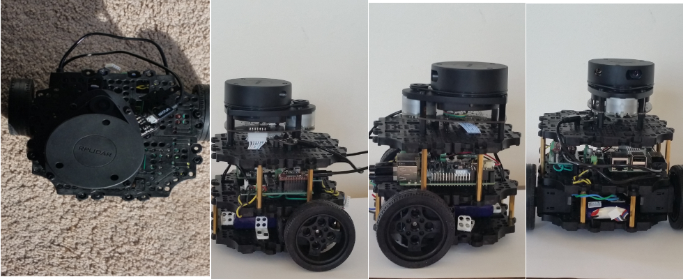

# Indoor Mapper
Indoor mapping and navigation is a fundamental problem in robotics. A robot capable of performing autonomous mapping and navigation can be roam independently inside an indoor environment and can be tasked to perform a variety of activities. Such a robot serves as a platform onto which a variety of robot applications can be built. Many of the same theory and techniques are applicable for outdoor navigaton which is a core technology for self driving cars. 

My goal in doing this project is learn apply the theory, tools and techniques used in robotics development. The most impactful application would be navigation and mapping where I will make use of the Robotic Operating System (ROS), probabilisitic robotics theory, navigation and mapping algorithms and embedded computers. I also hope that this project will showcase not only the above but also software best practices such as unit testing, documentation and continous integration. 

## Setup
The setup requires both building hardware and software. Detailed setup instruction are provided [here](./Setup.md). Hardware setup requires procuring parts as specified in [BOM](./design/Design.md/#bom). These parts will then need to be assembled and tested and some body measurements need to be performed for customizing the navigation. Two computing platform - PC and Raspberry Pi 3B (>= 16GB SD card) will be used and it is assumed that the PC runs Ubuntu 16.04 LTS and Raspberry Pi runs [Raspbian Stretch](https://www.raspberrypi.org/downloads/raspbian/). We will not cover Ubuntu installation instruction, they are covered elsewhere. 

## Usage
TBD. 
<!--
- add gif showing demo 
-->

## Contributing
For those interested in forking for modification or enhancing the project, below is a list of documents useful for understanding the project in detail
- IndoorMapper Report - TBD
- [Project Requirements v0.0 - In Progress](Requirements.md)
- [Design Document - In Progress](design/Design.md)
- Test Document - TBD

## Licensing

## Authors
Rishabh Kasliwal

## FAQs

