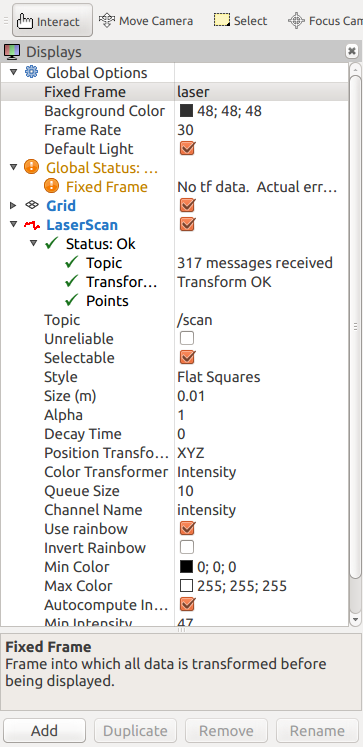
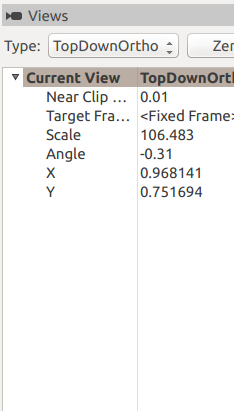
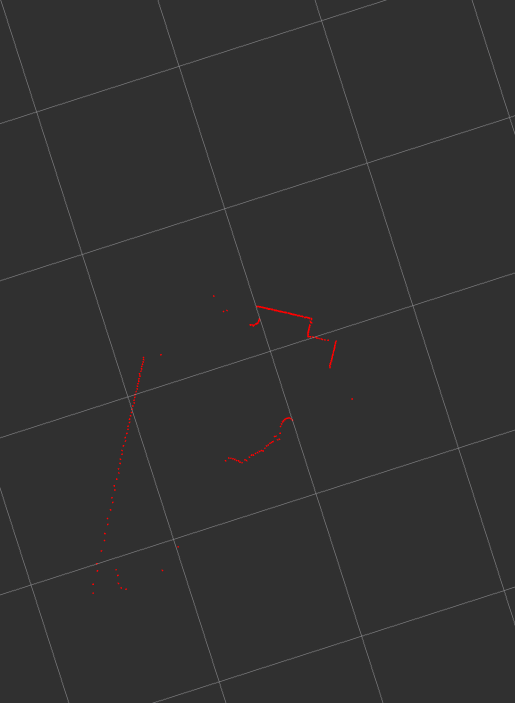

Here are the setup instructions for Indoor Mapping robot. 

# Software Setup
The software for the Indoor Mapper is deployed two machines. One is a PC running Ubuntu 16.04 LTS and other is Raspberry Pi 3 running Raspbian Stretch. We will detail the installation of hardware drivers as well ROS framework on both machines. 

## ROS Installation
We intend to run ROS nodes on both the PC and Raspberry Pi. Below are details for installation of ROS. 

### Installation of ROS on PC Running Ubuntu 16.04 LTS

### Installation of ROS on Raspberry Pi3 Running Raspbian Stretch
#### Cleaning up Raspberry Pi
Raspberry Pi has lot of bloatware which takes up space on the SD card. Before we install ROS, we will clean up the bloatware. Below are steps to remove wolfram-engine. 
```
> sudo apt-get purge wolfram-engine
> sudo apt-get clean; sudo apt-get autoremove
> sudo apt-get purge libreoffice*
> sudo apt-get clean; sudo apt-get autoremove
> sudo apt-get purge minecraft-pi
> sudo apt-get clean; sudo apt-get autoremove
> sudo apt-get purge sonic-pi
> sudo apt-get clean; sudo apt-get autoremove
```
#### Installation of ROS-Kinetic on Raspbian Stretch
We followed instruction provided [here](http://wiki.ros.org/action/fullsearch/ROSberryPi/Installing%20ROS%20Kinetic%20on%20the%20Raspberry%20Pi?action=fullsearch&context=180&value=linkto%3A%22ROSberryPi%2FInstalling+ROS+Kinetic+on+the+Raspberry+Pi%22)

We installed the base version of ROS-kinetic. This is the bare minimum. We didn't want to install the full version because we do not know at this point which packages we will install. We will mostly likely not run navigation/mapping tasks on Raspberry Pi because of the computational load. We will install packages on as-needed basis. 

### Configuring ROS for running on PC and Raspberry Pi3

#### Configuring Raspberry Pi for Connection over Wifi
For our purposes, we would like to remotely configure / control IndoorMapper from our PC. The onboard Raspberry Pi is capable of connectivity over Ethernet and Wifi. We would configure its Wifi, so that we can connect to it over our home Wifi network. 
In future, we could use this same home Wifi router to communicate to IndoorMapper and view its status over the internet from anywhere in the world. 

Based on the guidelines here, we configured the wireless interface first. We configured it for home network, with a netmask of `255.255.255.0` and gateway of `192.xxx.xxx.xxx`. The ip address was statically assigned. On Raspbian, interfaces are configured by editing the /etc/network/interfaces file. Our file looked as follows

```
# ethernet config
auto eth0
iface eth0 inet static
    address 192.xxx.xxx.xxx
    netmask 255.255.255.0
    gateway 192.xxx.xxx.xxx

# wifi config
auto wlan0
allow-hotplug wlan0
iface wlan0 inet static
    address 192.xxx.xxx.xxx
    netmask 255.255.255.0
    gateway 192.xxx.xxx.xxx
    wpa-conf /path_to_wpa_supplicant/wpa_supplicant.conf

source-directory /path_to_interfaces.d/interfaces.d
```

Then we configured the wpa_supplicant.conf. This file is read by the wpa_supplicant daemon, to perform wpa_client actions on the host machine. 

```
ctrl_interface=DIR=/var/run/wpa_supplicant GROUP=netdev
update_config=1
country=US

network={
        ssid="My_SSID"
        scan_ssid=1
        psk="pass_phrase"
        key_mgmt=WPA-PSK
}
```
We had to provide the `scan_ssid=1` field, because our SSID is hidden. The rest of the fields are standard. To test the Wifi, the ethernet was disconnected, and Pi was rebooted. On reboot, we did an ssh into Pi from our PC. 
```
> ssh pi@192.xxx.xxx.xxx
pi@192.xxx.xxx.xxx's password:
```
This indicates that we can communicate to Raspberry Pi over the home-WLAN. 

#### Communicating over multiple Machines using ROS
We intend to run some nodes on Raspberry Pi, and computation intensive nodes and ROS master on PC. To verify, that we could do so, we tested communication between talker and listener nodes running on Raspberry PI and PC respectively. 

It is assumed that ROS has already been installed on Raspberry Pi. We followed the ROS tutorial provided [here](http://wiki.ros.org/ROS/Tutorials/MultipleMachines)

1. Start ROS on PC
```
# start ROS master on PC
> roscore
# configure ROS_MASTER_URI
> export ROS_MASTER_URI=http://pc_ip:11311
# run listener
> rosrun rospy_tutorials listener.py
```
2. Start ROS on Raspberry Pi
```
# ssh to Pi
> ssh pi@192.xxx.xxx.
# Configure ROS_MASTER_URI
> export ROS_MASTER_URI=http://pc_ip:11311
#configure ROS_IP
> export ROS_IP=Raspi_wlan_ip
# run talker
> rosrun rospy_tutorials talker.py
```
This should start showing messages sent by talker to listener, on the PC. If successful, we are done. Now we have a distributed ROS system, where master runs on PC, and other ROS nodes run on either PC or Raspberry Pi. 

## Dynamixel Installation
We will install the drivers for controlling the servos on the robot. 


In these setup instruction, we will work with both the Dynamixel C++ SDK as well as ROS tools for controlling dynamixel. We have detailed the installation and usage examples for both Dynamixel SDK and ROS tools. 

### Dynamixel SDK Installation on Raspberry Pi3

#### Dynamixel SDK File Structure
Example codes are using either C/C++. Dynamixel SDK repo folder contains directories for each supported API language. We are interested in C++. 

In `c++` folder, you'll find cpp source files, header files, build files and example codes. 


Though the PortHandler which handles system communication environment is separated in three OSes - Linux, MacOS, Windows, the other sources are made to be able to be cross-compiled. We use a separate Makefile for each environment to build the src code. 

There is example code in `example` folder. For us, the subfolder `protocol2.0` contains the relevant example code. There are platform specific Makefiles in example/protocol2.0 to build the example code. 

The dynamixel SDK expect the device name to be `/dev/ttyUSB0` for linux system, we have verified that to be the case. Later we'll see how we can tweak the SDK to handle dyamixel servos being on other ports. 

Note: The SDK has been tested on Ubuntu 16.04 and Raspbian Stretch, which we are using. 

#### Library Setup on Ubuntu
For detailed instruction, see [here](http://emanual.robotis.com/docs/en/software/dynamixel/dynamixel_sdk/library_setup/cpp_linux/#cpp-linux). Below are steps for setting up library on Ubuntu 16.04 LTS. 

1. Compiler: GNU gcc ver. 5.4.0 20160609 or higher
```
> gcc -v
gcc version 5.4.0 20160609 (Ubuntu 5.4.0-6ubuntu1~16.04.10) 
```
2. Builder
```
> sudo apt-get install build-essential
```
3. Dependent Packages: packages needed for cross-compiling
```
> sudo apt-get install gcc-multilib g++-mulitlib
```
4. Build the library specific to Linux64 configuration. Navigate to `linux64` subdirectory in `build`
```
> pwd
/home/rk/repos/DynamixelSDK/c++/build/linux64
```
5. Invoke make: This will generate a shared library file, `libdxl_x64_cpp.so`
6. Install the library: 
```
> sudo make install
```
#### Running the Sample Code

**read_write**</br>
The example codes are protocol specific and system specific. We will test the read_write functionality. This function writes position values to the servo's microcontroller which makes it move in specific direction. We had to tweak the source code for the example

1. Navigate to example code for linux64
```
> pwd   
/home/rk/repos/DynamixelSDK/c++/example/protocol2.0/read_write/linux64
```
2. Invoke make
```
> make
> ls
Makefile  read_write
```
3. Make the port available to be used
> sudo chmod a+rw /dev/ttyUSB0
```
4. Run the executable
```
> ./read_write                   # the servo should rotate back and forth
```
Succeeded to open the port!
Succeeded to change the baudrate!
Dynamixel has been successfully connected 
```
In read_write.cpp, make sure these parameters are defined as below
```
#define ADDR_PRO_TORQUE_ENABLE          64 // Control table address is different in Dynamixel model
#define ADDR_PRO_GOAL_POSITION          116
#define ADDR_PRO_PRESENT_POSITION       132
```

One also needs to pay attention to definition of following parameters
```
#define DXL_ID                          2                   // Dynamixel ID: 1
#define BAUDRATE                        57600
#define DEVICENAME                      "/dev/ttyUSB0"      // Check which port is being used on your controller
```
The DXL_ID should match the servos identity. The next command line tools that we discuss allows us to give names (i.e. IDs) to the servos. Once we have done that, we shall be able to daisy chain the servos, in this scenario we will address each servo by its ID. If you choose you use a different USB
port, set it here, for ex. to `/dev/ttyUSB1` (with the double quotes)

**dxl_monitor**</br>
Robotis also provides code for interactive control through `dxl_monitor`. Navigate to dxl_monitor folder
```
> pwd
/home/rk/repos/DynamixelSDK/c++/example/dxl_monitor
```
Navigate to `linux64` folder, and make
```
> pwd
/home/rk/repos/DynamixelSDK/c++/example/dxl_monitor/linux64
> make
> ./dxl_monitor            # run to go into interactive mode
> ?                        # list command help
```
Use XL430-250T parameters as specified [here](http://emanual.robotis.com/docs/en/dxl/x/xl430-w250/#control-table-description)


### ROS Dynamixel Workbench Installation on Raspberry Pi3
Dynamixel workbench is a ROS package which allows use of ROS framework to control dynamixel servos. Here is the main [page](http://wiki.ros.org/dynamixel_workbench). We will install the dynamixel package on Raspberry Pi, since that is our robot computer and the dynamixel will be controlled by Pi through a USB-to-UART interface. 

#### Installing the FDTI Driver
1. Install hardware driver for FT232. FDTI devices have two types of driver - virual COM port driver (VCP) and D2XX API driver. FTDI VCP driver is build into the Linux kernel. On Linux, VCP drivers will appear as /dev/ttyUSBx. Since 

2. Verify built-in COM port
- Plug in FTDI device
- In terminal window
```
> dmesg | grep FTDI
# The following output should be generated
[334680.372193] usb 2-1.2.2: Manufacturer: FTDI
[334681.410183] usbserial: USB Serial support registered for FTDI USB Serial Device
[334681.410249] ftdi_sio 2-1.2.2:1.0: FTDI USB Serial Device converter detected
[334681.410899] usb 2-1.2.2: FTDI USB Serial Device converter now attached to ttyUSB0
[334683.068937] ftdi_sio ttyUSB0: FTDI USB Serial Device converter now disconnected from ttyUSB0
[334693.939291] usb 2-1.2.2: Manufacturer: FTDI
[334693.942056] ftdi_sio 2-1.2.2:1.0: FTDI USB Serial Device converter detected
[334693.942666] usb 2-1.2.2: FTDI USB Serial Device converter now attached to ttyUSB0
[334696.892600] ftdi_sio ttyUSB0: FTDI USB Serial Device converter now disconnected from ttyUSB0
[334718.771810] usb 2-1.2.2: Manufacturer: FTDI
[334718.774809] ftdi_sio 2-1.2.2:1.0: FTDI USB Serial Device converter detected
[334718.775587] usb 2-1.2.2: FTDI USB Serial Device converter now attached to ttyUSB0
[334889.403163] ftdi_sio ttyUSB0: FTDI USB Serial Device converter now disconnected from ttyUSB0
[334903.601907] usb 2-1.2.2: Manufacturer: FTDI
[334903.604827] ftdi_sio 2-1.2.2:1.0: FTDI USB Serial Device converter detected
[334903.605279] usb 2-1.2.2: FTDI USB Serial Device converter now attached to ttyUSB0
[334915.771189] ftdi_sio ttyUSB0: FTDI USB Serial Device converter now disconnected from ttyUSB0
[334925.854973] usb 2-1.2.2: Manufacturer: FTDI
[334925.858182] ftdi_sio 2-1.2.2:1.0: FTDI USB Serial Device converter detected
[334925.858748] usb 2-1.2.2: FTDI USB Serial Device converter now attached to ttyUSB0
```
It should say "FTDI USB Device now attached/detected" or something like that. 

#### Installing Dynamixel Workbench on Raspberry Pi3

We are interested in installing the following ROS packages for dynamixel - dynmixel_sdk, dynamixel-workbench-toolbox, dynamixel-workbench-controllers, dynamixel-workbench-operators. We will build these packages using the catkin utility. We assume that ROS has already been installed on Raspberry Pi, for instruction see [here](#ros-installation-raspberry-pi)

1. Create a separate workspace on Pi for workbench installation. We created a separate directory dynamixel_ws
```
> mkdir -p dynamixel_ws/src
> cd dynamixel_ws/src
> git clone https://github.com/ROBOTIS-GIT/dynamixel-workbench.git
> ls 
dynamixel-workbench
```
2. Lets view the package dependecies
```
> cd dynamixel-workbench
> find -P -name package.xml| while read line; do echo $line; cat $line | grep depend; done
./dynamixel_workbench_single_manager_gui/package.xml
  <buildtool_depend>catkin</buildtool_depend>
  <depend>roscpp</depend>
  <depend>qtbase5-dev</depend>
  <depend>qt5-qmake</depend>
  <depend>dynamixel_workbench_msgs</depend>
  <depend>dynamixel_workbench_toolbox</depend>
  <exec_depend>libqt5-core</exec_depend>
  <exec_depend>libqt5-gui</exec_depend>
./dynamixel_workbench_operators/package.xml
  <buildtool_depend>catkin</buildtool_depend>
  <depend>roscpp</depend>
  <depend>dynamixel_workbench_msgs</depend>
./dynamixel_workbench/package.xml
  <buildtool_depend>catkin</buildtool_depend>
  <exec_depend>dynamixel_workbench_controllers</exec_depend>
  <exec_depend>dynamixel_workbench_operators</exec_depend>
  <exec_depend>dynamixel_workbench_single_manager</exec_depend>
  <exec_depend>dynamixel_workbench_single_manager_gui</exec_depend>
  <exec_depend>dynamixel_workbench_toolbox</exec_depend>
./dynamixel_workbench_controllers/package.xml
  <buildtool_depend>catkin</buildtool_depend>
  <depend>roscpp</depend>
  <depend>sensor_msgs</depend>
  <depend>geometry_msgs</depend>
  <depend>dynamixel_workbench_msgs</depend>
  <depend>dynamixel_workbench_toolbox</depend>
./dynamixel_workbench_toolbox/package.xml
  <buildtool_depend>catkin</buildtool_depend>
  <depend>roscpp</depend>
  <depend>dynamixel_sdk</depend>
./dynamixel_workbench_single_manager/package.xml
  <buildtool_depend>catkin</buildtool_depend>
  <depend>roscpp</depend>
  <depend>dynamixel_workbench_msgs</depend>
  <depend>dynamixel_workbench_toolbox</depend>
```
One can see that `/dynamixel_workbench_single_manager_gui` has additional dependencies. This package is for GUI based dynamixel control, which we don't need. Lets first eliminate this package, and bring out the rest of the packages into the source directory
```
> rm -rf dynamixel_workbench dynamixel_workbench_single_manager_gui
> mv dynamixel_workbench* ../ 
> cd ../
> rm -rf dynamixel_workbench
```
Also in our installation, we found that `sensor_msgs` was not installed. We will add sensor_msgs to our existing base installation of ROS. 

3. Install sensor_msgs: Navigate to ros_catkin_ws and install the sensor_msgs package. This is following guidelines provided [here](http://wiki.ros.org/ROSberryPi/Installing%20ROS%20Kinetic%20on%20the%20Raspberry%20Pi)
```
> cd ~/ros_catkin_ws
> rosinstall_generator sensor_msgs --rosdistro kinetic --deps --wet-only --tar > kinetic-custom_ros.rosinstall
> wstool merge -t src kinetic-custom_ros.rosinstall
> wstool update -t src/
> rosdep install --from-paths src --ignore-src --rosdistro kinetic -y -r --os=debian:stretch
> sudo ./src/catkin/bin/catkin_make_isolated --install -DCMAKE_BUILD_TYPE=Release --install-space /opt/ros/kinetic
> source devel_isolated/setup.bash
> rospack find sensor_msgs
/home/pi/ros_catkin_ws/src/common_msgs/sensor_msgs
```
Now let's build


4. Build and install dynamixel_workbench
```
> catkin_make
# build complete
> source devel/setup.sh
```
#### Testing Dynamixel Workbench installation on Raspberry Pi
The system should be setup such that the Raspberry Pi is connceted to the dynamixel servo through the USB to UART interface. We performed these tests by ssh-ing into Raspberry Pi. 

1. Start the ROS master node
```
> roscore
```
2. Launch the velocity controller node using the provided launch file in the dynamixel_workbench metapackage
```
> roslaunch dynamixel_workbench_controllers velocity_control.launch
```
3. Run the wheel operator
```
> rosrun dynamixel_workbench_operators wheel_operator
[ INFO] [1543808534.781284905]: Set angular velocity(+-0.2 rad/sec) to your Dynamixel!! by using keyboard
[ INFO] [1543808534.781477040]: w : Forward
[ INFO] [1543808534.781530946]: x : Backward
[ INFO] [1543808534.781580530]: a : Left
[ INFO] [1543808534.781630582]: d : Right
[ INFO] [1543808534.781679852]: s : STOPS
```
Now use the keyboard controls move the motor. Ideally, the servos should be mounted onto a chassis. When keyboard controls are sent, one expects the chassis to move in forward or reverse. 

## RPLIDAR

### RPLIDAR SDK
We will detail use of RPLIDAR SDK on Ubuntu 16.04 LTS. 

1. Clone the open source SDK from github repository
```
git clone https://github.com/Slamtec/rplidar_sdk.git
```


## RPLIDAR Setup
The `rplidar` [package](http://wiki.ros.org/rplidar) provides basic device handling for 2D Laser scanner, RPLIDAR A1

The driver publishes device-dependent sensor_msgs/LaserScan data as required by the [navigation stack](http://wiki.ros.org/navigation/Tutorials/RobotSetup#Sensor_Information_.28sensor_sources.29) 

The `rplidar` package provides the following nodes:
1. rplidarNode: is a driver for RPLIDAR. It reads the RPLIDAR raw scan results using RPLIDAR's SDK (over a USB to UART connection) and converts to ROS sensor_msgs/LaserScan messages. It also offers services for starting and stopping the scan motor. When starting the node, one can set the following parameters
- serial_port: 
- serial_baudrate:
- frame_id:
- scan_mode: 


### Installation on Raspberry Pi
1. Download the package source code from the git repository 
```
> mkdir -p ~/rplidar_ws/src
> cd ~/rplidar_ws/src 
> git clone https://github.com/Slamtec/rplidar_ros
> cd ../
```
We checked the dependencies by inspecting the package.xml file, and found them to be present on the system. One can check them by using `rospack find dep`.

2. Build package using catkin_make
```
> catkin_make
```
3. Source the path
```
> source devel/setup.bash
```
4. Launch Rplidar
On PC, configure ROS_MASTER
```
> export ROS_MASTER_URI=http://192.xxx.xxx.xxx:11311
```
Then start roscore
```
> roscore
```
Also start rviz
```
> rosrun rviz rviz
```
We'll come back to configure rviz later

On Raspberry Pi, configure ROS_MASTER and ROS_IP
```
> export ROS_MASTER_URI=http://192.xxx.xxx.xxx:11311
> export ROS_IP=http://192.xxx.xxx.xxx
```
Launch rplidar.launch file. This will start the `rplidarNode` on Raspberry Pi, with some present parameters in the launch file
```
> roslaunch rplidar_ros rplidar.launch
```

On the PC, we can verify that rplidarNode is running, by invoking
```
> rosnode list
/rosout
/rplidarNode
```
You should also be able to see the rostopic `/scan` being published by rplidarNode. We need to capture this topic in rviz to view the live scan data. 


In rviz, add the topic scan in the Displays list. It will however throw the following error
```
For frame [laser]: Fixed Frame [map] does not exist
```
This is because we have not setup a tf tree that relates the /map frame and the /laser frame 
We need to change the global settings in rviz. Set the `Fixed Frame` to `/laser`. Now you should be able to view the scan data as shown in the image below





Also change the view setting Type to TopDownOrthogonal as show below



The scan should look something like this


5. From here, one can use the /scan data for mapping or navigation purposes. 

## References
- [Sensors for Mobile Robot-1](https://www.sensorsmag.com/components/choosing-best-sensors-for-a-mobile-robot-part-one)
- [Sensors for Mobile Robot-2](https://www.sensorsmag.com/components/choosing-best-sensors-for-a-mobile-robot-part-two)
- [Advice on Robot for Mapping and Navigation](https://www.reddit.com/r/robotics/comments/3mv3q2/robot_mapping_and_navigation_question/)
- [UART to half duplex1](https://devtalk.nvidia.com/default/topic/1039093/half-duplex-uart-from-dev-ttyths2/)
- [UART to hald duplex2](https://wot.lv/using-dynamixels-roboplus-without-usb2dynamixel.html)
- [Dynamixel SDK](http://emanual.robotis.com/docs/en/software/dynamixel/dynamixel_sdk/overview/)
- Connectors
  - [Connectors Dynamixel](http://support.robotis.com/en/product/actuator/dynamixel/dxl_connector.htm) 
  - [Connectors 
- [XL430-W250T Control Table](http://emanual.robotis.com/docs/en/dxl/x/xl430-w250/#control-table-description)
- [Dynamixel SDK C++ library Setup](http://emanual.robotis.com/docs/en/software/dynamixel/dynamixel_sdk/library_setup/cpp_linux/#cpp-linux)
- [Dynamixel Protocol 2.0](http://emanual.robotis.com/docs/en/dxl/protocol2/)
- [RPiLIDAR SDK](https://github.com/Slamtec/rplidar_sdk)
- [RpiLIDAR User Manual](docs/slamtec_lidar_user_man.pdf)
- [RpiLIDAR Protocol](docs/slamtec_lidar_interface_protocol.pdf)


ROBOTIS Dynamixel SDK is a software development kit that provides Dynamixel control functions using packet communication. The Dynamixel API requires programming in C/C++. We wull use the recommended Protocol 2.0 for communicating with the X-series servo. We will test the SDK on Ubuntu 16.04 LTS running on Intel X86 and Raspbian running on Raspberry Pi 3. We will use FT232RL serial board from Sparkfun with custom circuit to perform half-duplex communication with the servo. Finally we will also test the dynamixel using ROS C++ package on Ubunutu or Raspbian. 

# Hardware Setup

